# 2. 驱动安装（选读部分）

*本部分非必读部分，仅在主板无法被电脑识别时使用，如果已经识别可直接跳过！！！*

（注意：如果开发板在Arduino或kidsblock或Mixly课程无法被识别，请先检查开发板是否连接到位并且连接电脑其他USB端口重新测试，如果依旧不行再开始以下驱动安装课程）

⚠️ **特别提醒：本教程是以驱动芯片CP2102为例，其他的驱动芯片，可以参考。**

## 2.1 Windows系统驱动安装

### 2.1.1 检查驱动程序

1\. 将开发板连接到电脑（如图）。

2\. 打开 “ **设备管理器** ” 。

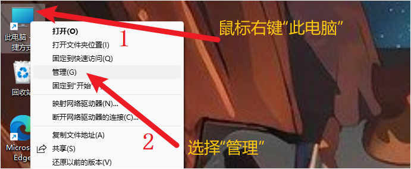

3\. 如下图所示，电脑自动安装了驱动就可以跳过此教程。

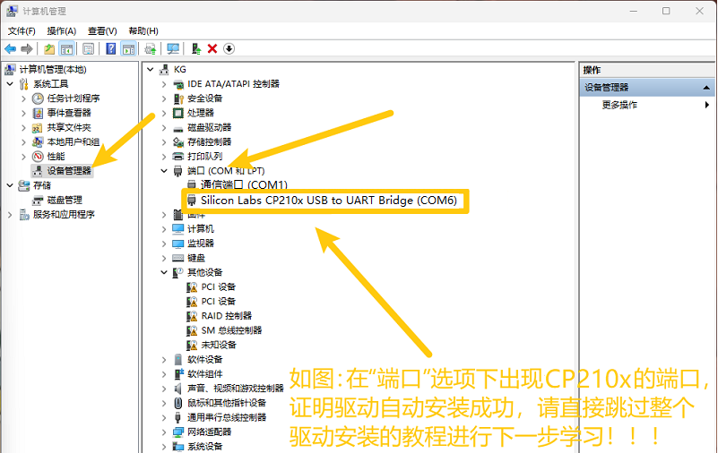

### 2.2.2 手动安装驱动程序

1\. 如下图所示，电脑没有自动安装驱动，需要手动安装。

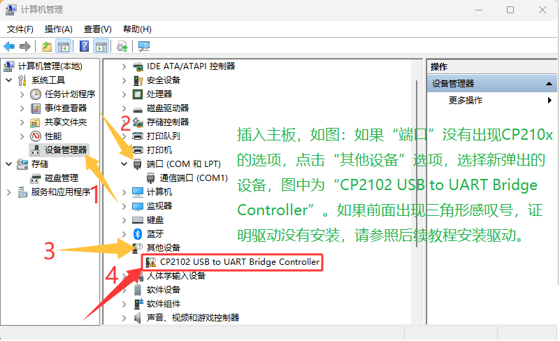

2\. 下载驱动。

Windows系统驱动下载：[drivers_Windows驱动](./drivers_Windows.7z)

**提醒：这里是将drivers_Windows驱动压缩包下载保存与电脑桌面上为例，你也可以保存于任何自己方便的位置。**

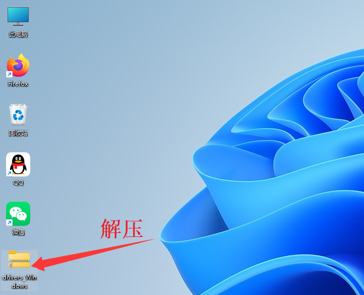

3\. 将驱动压缩包解压，放于电脑桌面上。

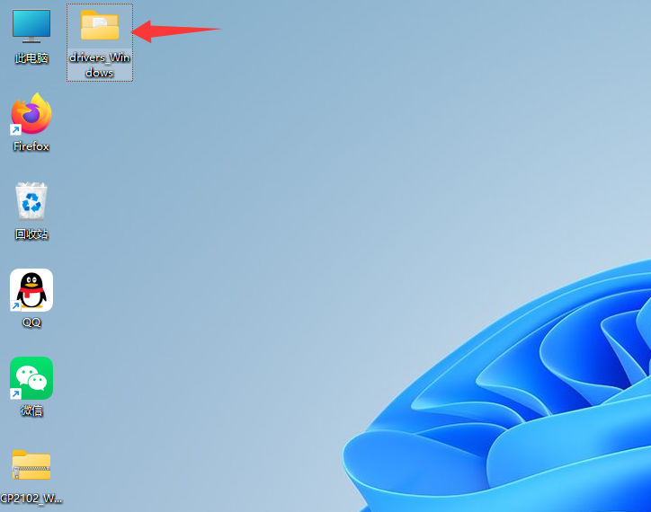

4\. 打开 “ **设备管理器** ” ，找到 “ **其他设备** ”，鼠标右键单击 “ **CP2102 USB to UART Bridge Controller** ” ，出现对话框，点击 “ **更新驱动程序** ”。

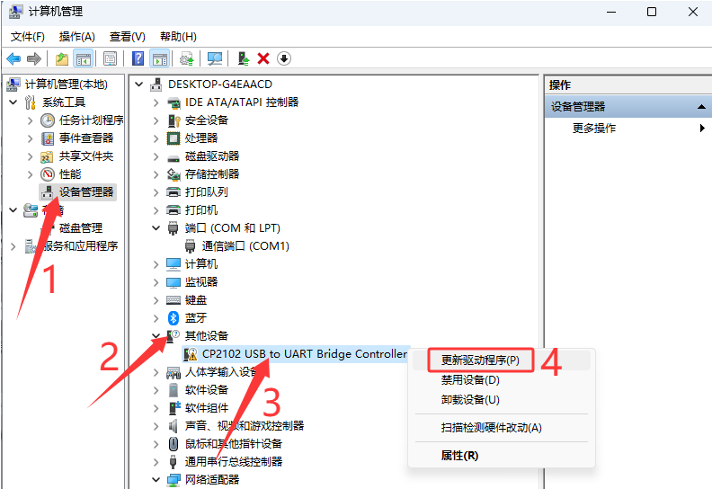

5\. 点击 “ **浏览我的电脑以查找驱动程序** ”，跳转 “**更新驱动程序**” 页面。

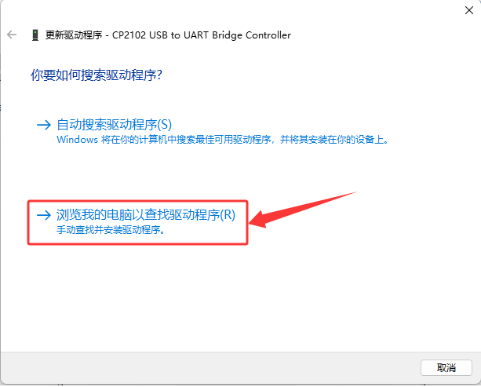

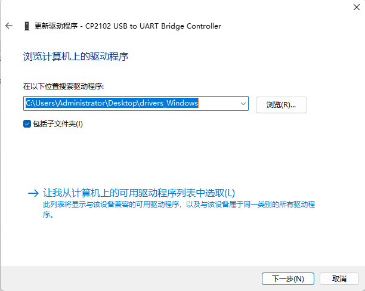

6\. 在 “ **更新驱动程序** ” 页面中点击 “ **浏览** ”按钮，找到电脑桌面上的 “ **drivers_Windows** ” 文件夹，点击 “ **drivers_Windows** ” 文件夹，然后点击 “ **确定** ”，之后再单击 “ **下一步** ”。

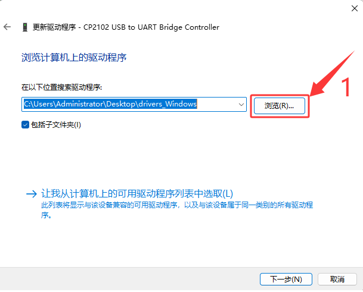

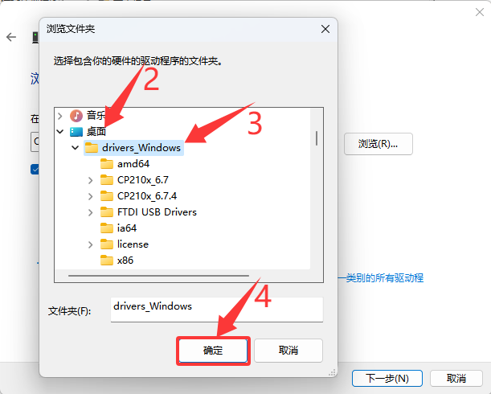

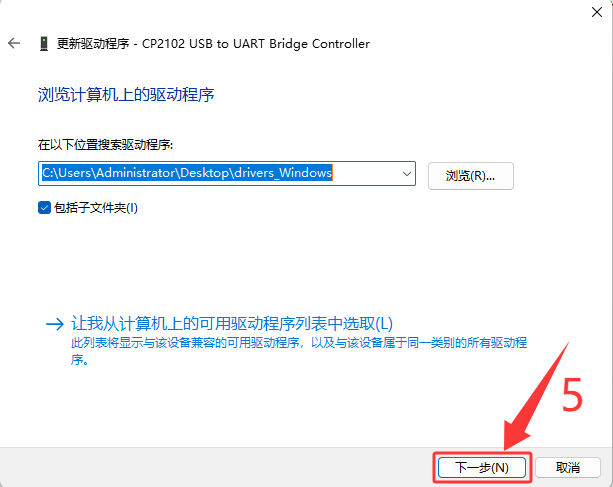

7\. 等待几秒钟后，驱动安装成功，点击“**关闭**”按钮。

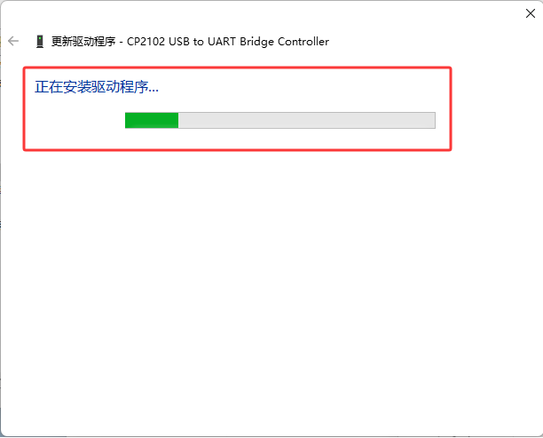

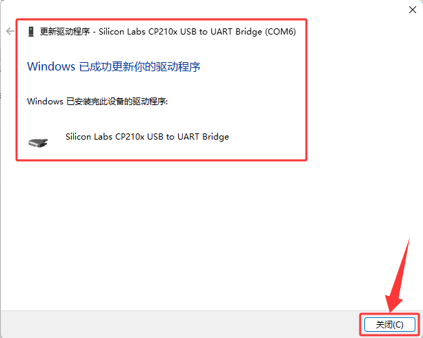

8\. 打开 “ **设备管理器** ” ，可以看到安装成功的串口端口。

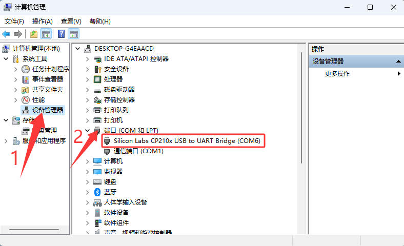

## 2.2 Mac系统驱动安装

### 2.2.1 检查驱动程序

1\. 将开发板连接到电脑（如图）。

2\. 打开 “**关于本机->系统报告->硬件->USB**” 。右侧为 “**USB设备树**” 。如果USB设备工作正常，您将发现其 “**厂商ID**” 等设备。

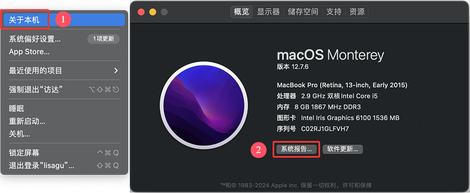

3\. 打开 “**应用程序-实用程序**” 文件夹下的 “**终端**” 程序，键入命令 “**ls /dev/tty.***” 。

你应该看到 “**tty.wchusbserialx**”，其中“**x**”是分配的设备号，类似于Windows COM端口分配。

### 2.2.2 手动安装驱动程序

1\. 如下图所示，电脑没有自动安装驱动，需要手动安装。

2\. 下载驱动。

Mac系统驱动下载：[CP2102_MAC驱动](./CP2102_MAC.7z)

**提醒：这里是将CP2102_MAC驱动压缩包下载保存与电脑桌面上为例，你也可以保存于任何自己方便的位置。**

3\. 将驱动压缩包解压，放于电脑桌面上。

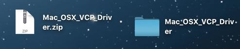

4\. 打开文件夹，双击 SiLabsUSBDriverDisk.dmg 文件。

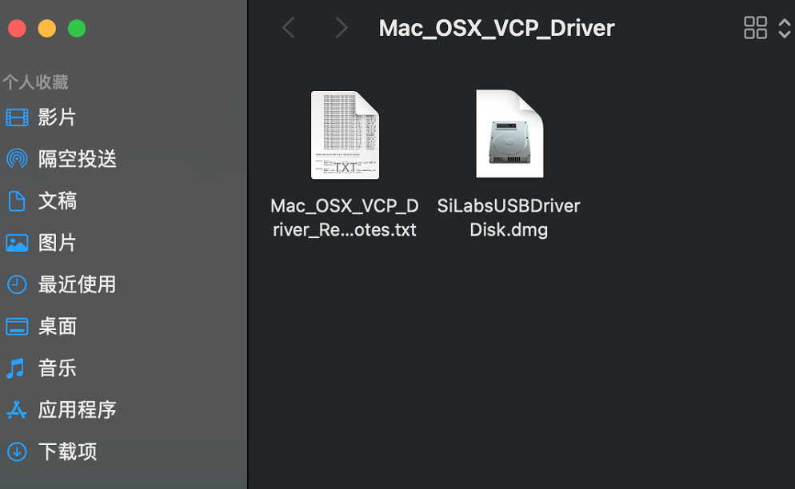

5\. 可以看到以下文件。

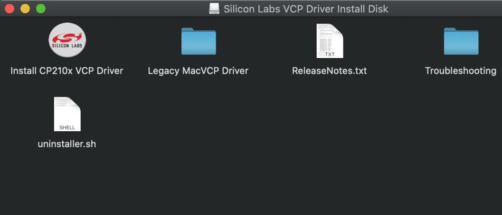

6\. 双击 “**Install CP210x VCP Driver**” 等待界面。然后点击 “**Continue**”。

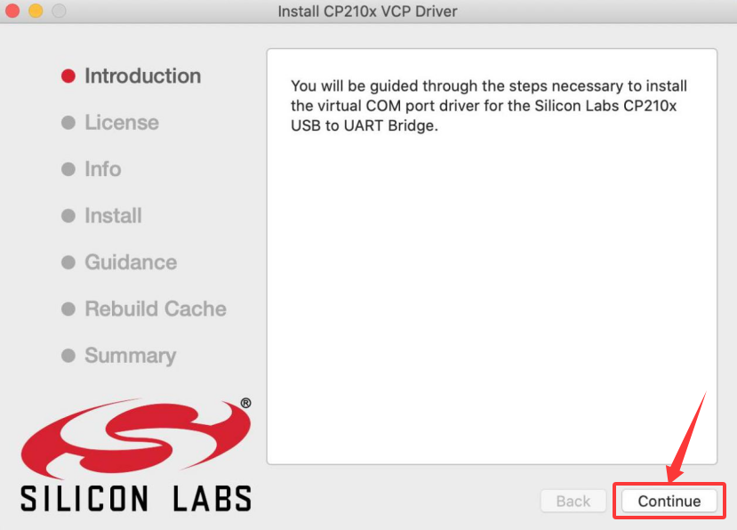

7\. 先点击 “**Agree**” ，然后点击 “**Continue**”。

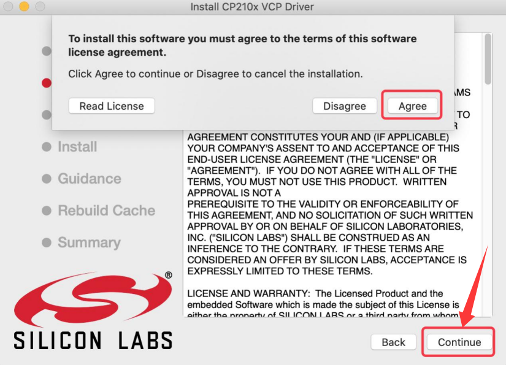

8\. 继续点击 “**Continue**” ，然后输入你的用户与密码，输入后继续。

⚠️ **特别提醒：** 安装到最后会弹出：System Extension Updated（但还没放行）。macOS 会拦截，必须去 “**安全性与隐私**” 允许。

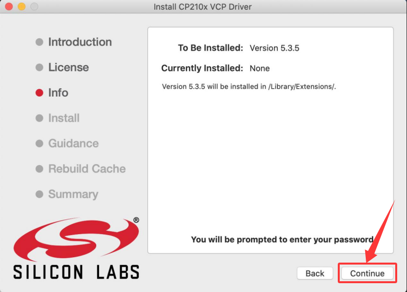

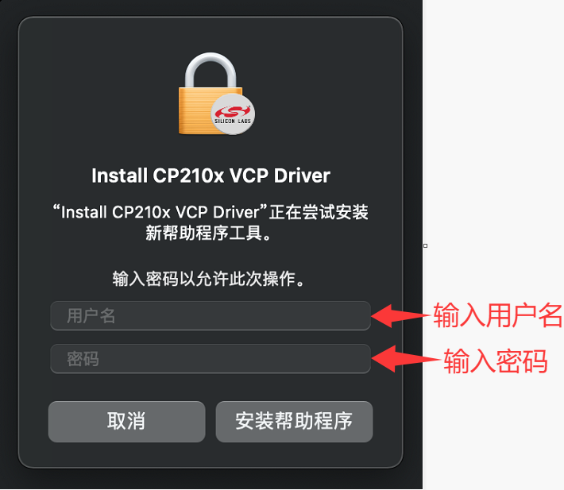

9\. 回到安装界面，根据提示等待安装。

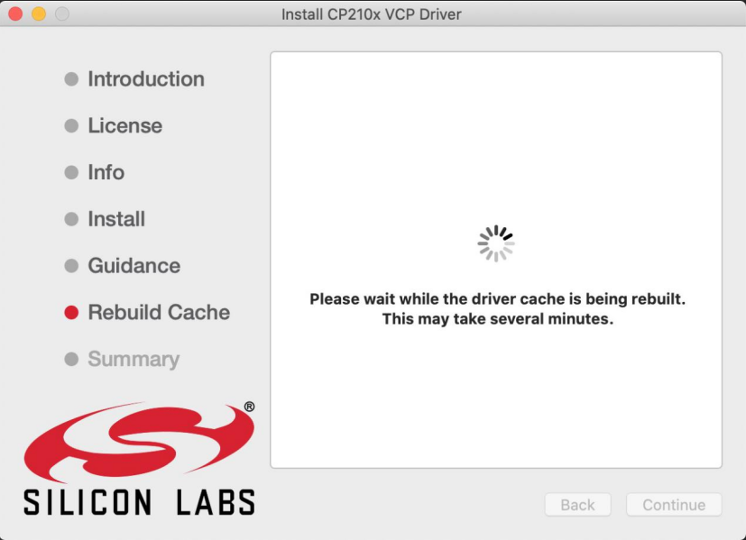

10\. 安装成功。

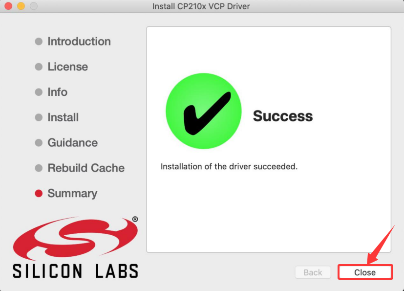

11\. 安装后在「**隐私与安全性**」允许，并且重启电脑。

12\. 将主控板连接USB线插入电脑的USB接口时，请打开 “**关于本机->系统报告->硬件->USB**” 。右侧为 “**USB设备树**” 。如果USB设备工作正常，您将发现其 “**厂商ID**” 等设备。

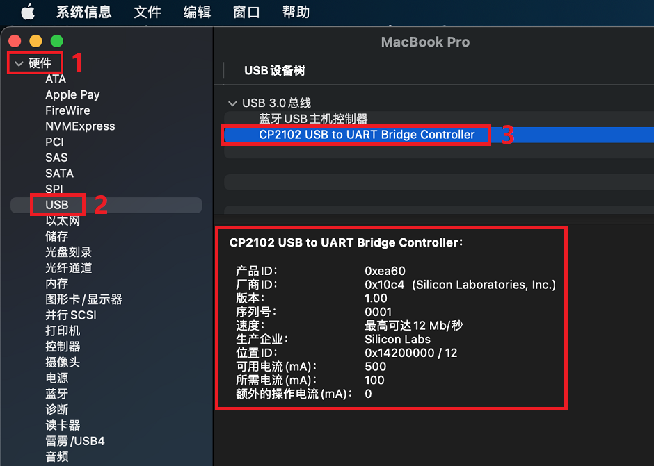

打开 “**应用程序-实用程序**” 文件夹下的 “**终端**” 程序，键入命令 “**ls /dev/tty.***” 。

你应该看到 “**tty.wchusbserialx**”，其中“**x**”是分配的设备号，类似于Windows COM端口分配。