# 3. Arduino教程

## 3.1 资料下载

请先下载Arduino教程所需资料（包含：示例代码、库文件 等）：[Arduino资料](./Arduino.7z)

## 3.2 Arduino IDE 简介

Arduino IDE是一款专为Arduino硬件设计的集成开发环境，它以初学者友好的界面和强大的开源代码支持而闻名。这款工具不仅简化了编程过程，降低了开发门槛，还为初学者提供了一个易于上手的学习平台。

Arduino IDE拥有简洁直观的用户界面，支持语法高亮、自动完成等功能，使得编程过程变得轻松愉快。更重要的是，它基于开放源代码，这意味着用户可以自由访问、修改和分发代码，从而大大扩展了开发的可能性。

对于初学者来说，Arduino IDE提供了丰富的教程、示例代码和社区支持，帮助他们快速上手并解决实际问题。同时，开源代码的特性也意味着用户可以借鉴和学习他人的代码，加速自己的学习进程。

总之，Arduino IDE以其初学者友好的界面和强大的开源代码支持，成为了Arduino开发者不可或缺的工具之一，无论是初学者还是专业人士，都能从中受益。

### 3.2.1 Windows 系统

**特别提醒：本教程采用的 Arduino IDE 版本是 2.3.10 。如果是其他版本的话，不能保证本教程提供的示例代码能编译和上传成功。** 

#### 3.2.1.1 Arduino IDE下载 

我们先到Arduino官方的网站：[Software | Arduino](https://www.arduino.cc/en/software/) 下载 Arduino IDE。

Arduino 软件有很多版本，有Windows，Mac，Linux系统的（如下图），而且还有过去老的版本，你只需要下载一个适合自己计算机系统的版本即可。

这里是以下载 **Windows Win 10 or newer(64-bit)** 为例，你也可以根据自己所需，选择下载 **Windows ZIP file**。选择如下图。

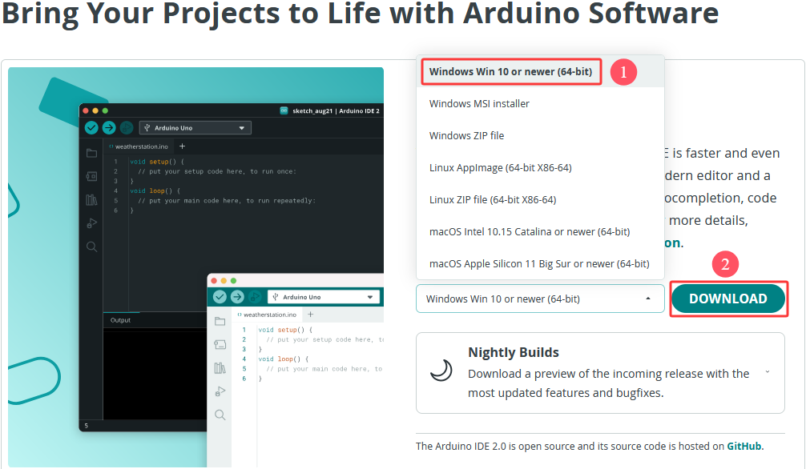

这里我们以Windows系统的为例给大家介绍下载和安装的步骤。Windows系统的也有两个版本，一个版本是安装版：Windows Win 10 or newer(64-bit) ；另一个是下载版：Windows ZIP file，是不用安装，直接下载文件到电脑，解压缩就可以用了。

#### 3.2.1.2 Arduino IDE安装

1\. 保存从软件页面下载的.exe文件到硬盘驱动器，然后简单地运行该文件.


2\. 阅读许可协议并同意.


3\. 选择安装选项.


4\. 选择安装位置.


5\. 单击 "Finish" 并运行Arduino IDE


### 3.2.2 MacOS 系统

#### 3.2.2.1 Arduino IDE下载

我们先到Arduino官方的网站：[Software | Arduino](https://www.arduino.cc/en/software/) 下载 Arduino IDE。

不同的系统，需要下载不同的Arduino IDE，下载方式和Windows类似。这里是以下载 **macOS Intel 10.15 Catalina or newer(64-bit)** 为例，你也可以根据自己所需，选择下载 **macOS Apple Silicon 11 Big Sur or newer(64-bit)**。选择如下图。


#### 3.2.2.2 Arduino IDE安装

Arduino IDE下载之后，双击下载的`arduino_ide_xxxx.dmg`文件并按照说明将 **Arduino IDE.app** 复制粘贴到 **Applications** 文件夹，几秒钟后您将看到 Arduino IDE 安装成功.


### 3.2.3 Linux 系统

#### 3.2.3.1 Arduino IDE下载

我们先到Arduino官方的网站：[Software | Arduino](https://www.arduino.cc/en/software/) 下载 Arduino IDE。

不同的系统，需要下载不同的Arduino IDE，下载方式和Windows类似。这里是以下载 **Linux Applmage(64-bit X86-64)** 为例，你也可以根据自己所需，选择下载 **Linux ZIP file(64-bit X86-64)**。选择如下图。


#### 3.2.3.2 Arduino IDE安装

关于在 Linux 系统上安装 Arduino IDE 2 的教程，请参考链接：[https://docs.arduino.cc/software/ide-v2/tutorials/getting-started/ide-v2-downloading-and-installing/#linux](https://docs.arduino.cc/software/ide-v2/tutorials/getting-started/ide-v2-downloading-and-installing/#linux)

## 3.3 设置Arduino IDE语言

⚠️ **特别提醒：Windows系统、MAC系统等不同系统，arduino IDE语言设置方法差不多，可以参考。**

1\. 首先打开Arduino IDE.


2\. 点击 “**File** ——>**Preferences...**”，在 **Preferences** 对话框中，单击 “**English**” 按钮选择 “**中文(简体)**”，然后单击 “**OK**”.

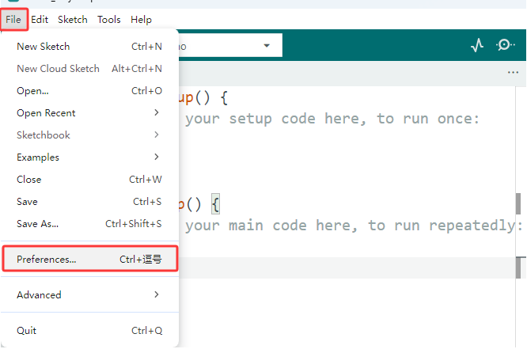


3\. 这样，arduino IDE的语言切换完成了，arduino IDE的语言为中文(简体)。

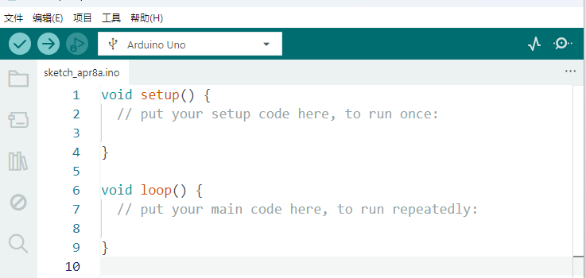

## 3.4 Arduino IDE说明

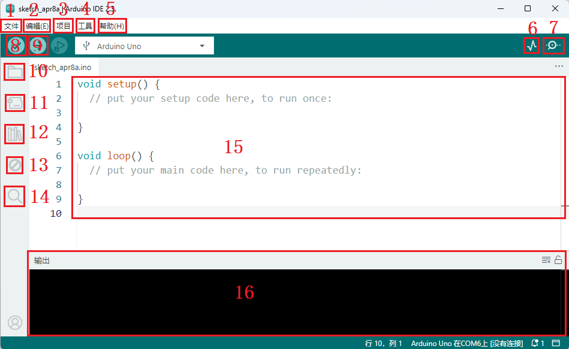

1\. “文件”：列表里面的功能有新建项目，打开程序，打开最近使用的代码，打开示例代码，关闭IDE，保存代码，首选项，高级设置等。

2\. “编辑”：列表里面的功能有复制，粘贴，自动格式化，字体大小等这个一般都是使用快捷键进行操作。（建议坚持使用快捷键，接触多了就水到渠成了）。

3\. “项目”：列明里面的常用功能有验证\编译代码，上传代码，导入库等。

4\. “工具”：列表里面的常用功能有开发板选择，端口选择，这两个很重要。

5\. “帮助”：点击这个可以查看IDE版本已经官方的参考文件。

6\. “串口绘图仪”：它会将串口的数据以折线图的样式显示出来。

7\. “串口监视器”：可以将我们需要查看的数据在这里进行打印显示。

8\. 验证程序按钮。

9\. 验证并上传程序按钮。

10\. “项目文件夹”：可以新建项目，还可以只有arduino Cloud进行同步和编辑。

11\. “开发板管理器”：可以添加或删除开发板。

12\. “库管理”：就要添加和删除库。

13\. “调试”：可以对代码进行监视与断点调试。

14\. 搜索框。

15\. 代码编辑区。

16\. IDE提示区（上传代码报错或成功）和串口监视器显示区

至此Arduino IDE说明教程结束了，请学习如何给Arduino IDE添加库文件，如果没有添加库文件IDE会报错。

## 3.5 给Arduino IDE安装库文件(**重要**)

⚠️ **特别提醒：Windows系统、MAC系统等不同系统，安装库文件的方法差不多，可以相互参考；这里是以Windows系统为例。**

### 3.5.1 什么是库文件

库是代码的集合，使您可以轻松地连接到传感器、显示器、模块等。

例如：LiquidCrystal_I2C库使LCD1602显示变得容易，Internet上有数百个其他库可供下载。参考中列出了内置库和手动添加的库。 

在编译代码或上传代码时，如果出现报错信息 “No such file or directory”，那说明缺少相应的库文件。

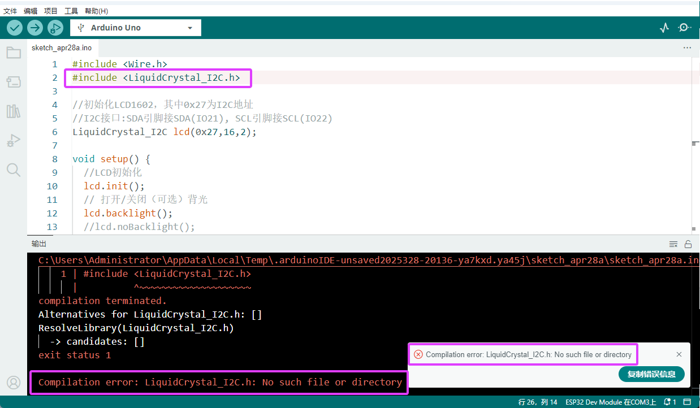

### 3.5.2 如何安装库文件

在这里，我们将为您介绍最简单的添加库的方法。我们是以添加 IRremote 库文件为例。

1\. 首先，打开Arduino IDE.


2\. 然后，依次点击IDE左上角的 “**项目” > “导入库” > “添加 .Zip 库...”**


3\. 导航到库文件所在的目录（在 `资料下载` 中下载的ZIP文件解压，这里是以资料下载到电脑桌面上为例），打开文件夹 `Arduino_库文件`，然后选择`EspSoftwareSerial.zip`文件，点击 “**打开**” 按钮。

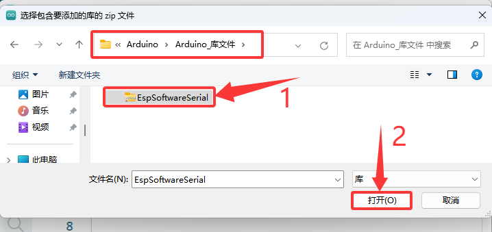

4\. 安装完成后，你将收到一条通知（已从EspSoftwareSerial存档成功安装库），同时输出框会显示 “**Library installed**”，确认该库已成功添加到Arduino IDE中。下次需要使用此库时，你不需要重复安装过程。

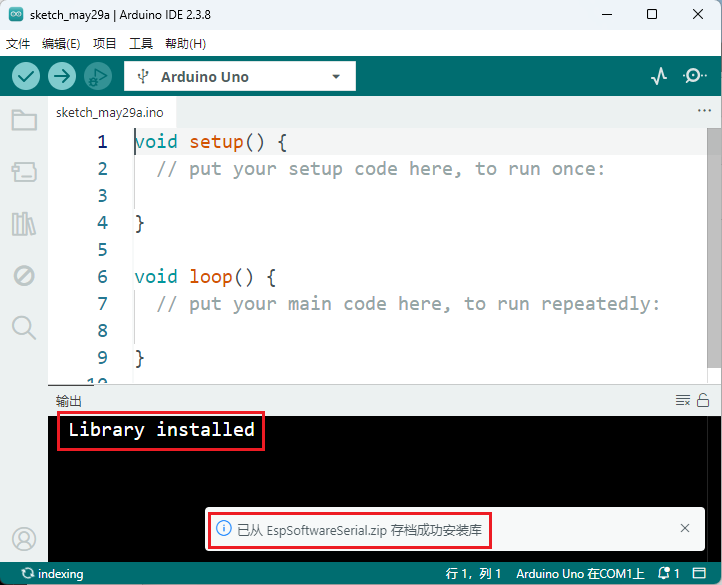

5\. 重复前面相同的添加过程(方法)来添加其他(剩余)的库文件，这里就不一一重复讲解了。

## 3.6 使用Arduino IDE上传第一个程序

先将Arduino开发板通过USB线连接到电脑。

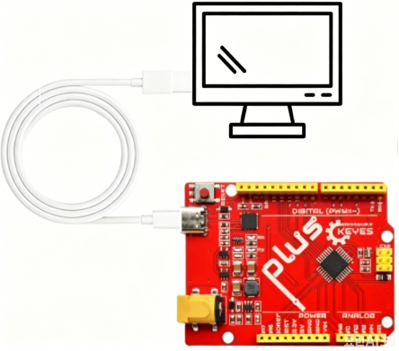

打开Arduino IDE, 选择对应的开发板型号 (Arduino Uno)。


选好开发板后，选择开发板的COM口，开发板安装完驱动后会显示一个COM端口，如果你不知道是哪个，可以进入你电脑的设备管理器中进行查看，如下图：（如果你有很多COM端口，你不知道是哪个就可以拔掉开发板看哪个消失了，然后再插上开发板消失的COM口又会显示出来，如果没有COM就请检查是否有安装好开发板驱动）


从图中可知我们的COM端口是COM3，我们在 “**工具**” 列表中选择 “**端口**” 然后选择 “COM3”。

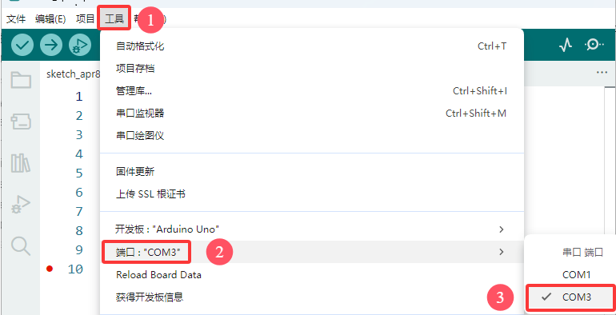

连接上开发板后，这两个地方都会显示已连接的标志，然后添加代码：这里我们提供一个示例代码，代码功能是在串口监视器中每隔一秒钟打印一次 “Hello Keyes!”

将下面的代码复制粘贴到arduino IDE的代码区

```c
/*
  keyes 
  打印 “Hello Keyes!”
  http://www.keyesrobot.com
*/
void setup() {  
    // 把你的设置代码放在这里，运行一次:
    Serial.begin(9600);  //设置串口波特率为9600
}

void loop() {  
    // 将主代码放在这里，以便重复运行:
    Serial.println("Hello Keyes!");  //串口打印
 	delay(1000);  //延迟1秒
}
```


然后我们点击编译并上传代码，上传成功后IDE也会有两个提示，如图：

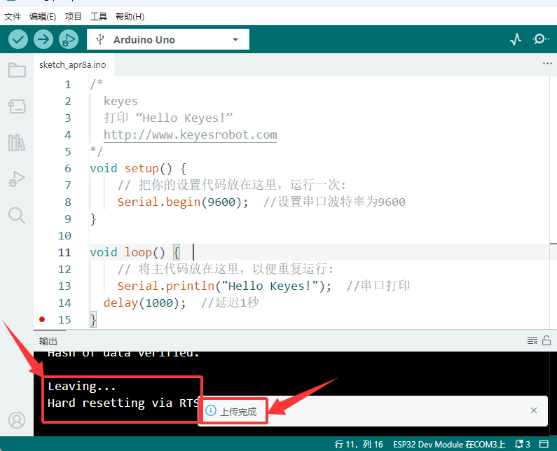

然后我们点击“串口监视器”图标便能打开串口监视器，然后设置波特率为**9600**，就能看到串口打印字符串 “**Hello Keyes!**”

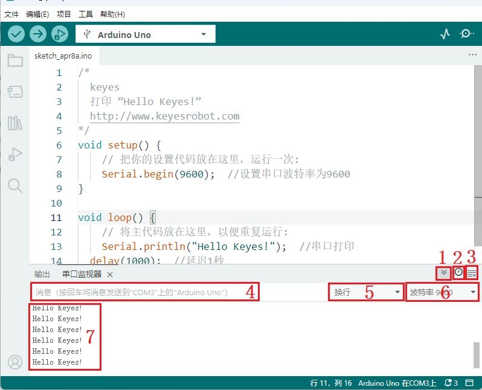

1\. “切换自动滚动”：设置打印窗口是否跟随打印.

2\. “切换时间戳 ”：设置是否显示打印时间。

3\. “清除输出 / 清空输出”：清除打印窗口中的数据。

4\. 串口输入框。

5\. 串口发送格式。

6\. 设置波特率，点击即可选择需要的波特率。

7\. 打印窗口。

## 3.7 Arduino基础代码介绍

更多详细解释请参考官方链接：[Language Reference | Arduino Documentation](https://docs.arduino.cc/language-reference/)

---------------

## 3.8 与Arduino开发板配合使用（以主控板Arduino Uno 板型为例）

### 3.8.1 读取语音指令

**接线图**

用表格和模拟图展示对应模块与扩展板或开发板的GPIO。

| 智能语音模块 | 扩展板/开发板 |
| :--: | :-----------: |
| GND  |      GND      |
| VCC  |      5V       |
| RXD  |      D4       |
| TXD  |      D5       |

**接线模拟图**

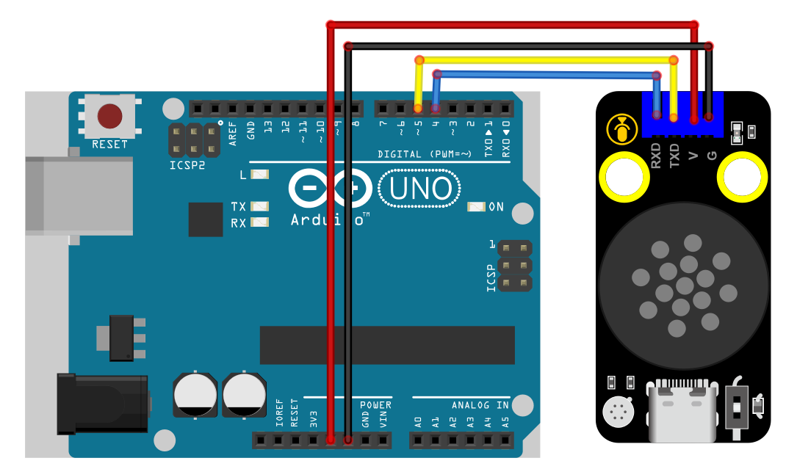

**实验代码**

```C
#include <SoftwareSerial.h>

// 定义软件串口引脚（RX, TX）
SoftwareSerial mySerial(4, 5); // 引脚 4 为 RX，引脚 5 为 TX

void setup() {
  Serial.begin(9600); // 硬件串口（与电脑通信）
  mySerial.begin(9600); // 软件串口（与外设通信）
  mySerial.println("Software Serial Test"); 
}

void loop() {
  if(mySerial.available()) { // 接收外设数据
    int c = mySerial.read();//将接收到的外设数据进行赋值
    Serial.println(c);//将接收到的外设数据进行打印 
  }
} 
```

**实验结果**

按照接线图正确接好模块，选择好正确的开发板板型（Arduino Uno）和 适当的串口端口（COMxx），然后单击  按钮上传示例代码至Arduino控制板。代码上传成功后，单击Arduino IDE右上角的 ，打开串口监视器，设置串口波特率为 9600。

对着智能语音模块上的麦克风，使用唤醒词 “你好，小智” 或 “小智小智” 来唤醒智能语音模块，同时喇叭播放回复语 “有什么可以帮到您”；接下来即可通过串口打印窗口查看智能语音模块接收到语音命令词所对应的命令码 等。

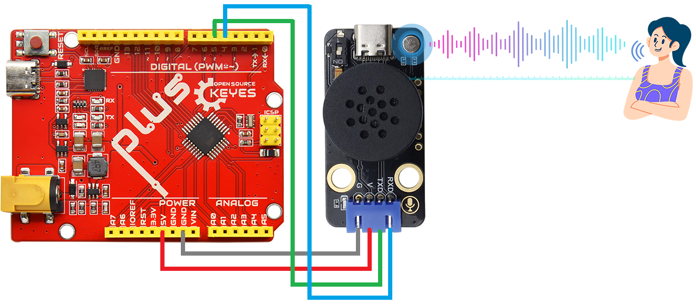

语音模块唤醒后，对着麦克风说：“打开台灯” 或 “请开灯” 或 “开灯” 或 “打开灯” 或 “我回来了”等命令词时，串口打印命令参数 “1”，同时喇叭播放对应的回复语 “已为您打开照明”。

对着麦克风说：“关闭台灯” 或 “请关灯” 或 “关灯” 或 “睡觉了” 或 “关上灯” 或 “我出去了”等命令词时，串口打印命令参数 “2”，同时喇叭播放对应的回复语 “已为您关闭照明”。

对着麦克风说：“调亮一点” 或 “亮一点”等命令词时，串口打印命令参数 “3”，同时喇叭播放对应的回复语 “灯光已调亮”。

对着麦克风说 “调暗一点” 或 “暗一点”等命令词时，串口打印命令参数 “4”，同时喇叭播放对应的回复语 “灯光已调暗”。

其他的这里就不一一分别陈述，请查看 **产品介绍** 所列的语音识别指令和语音播报指令，所对应的命令码和信息号。

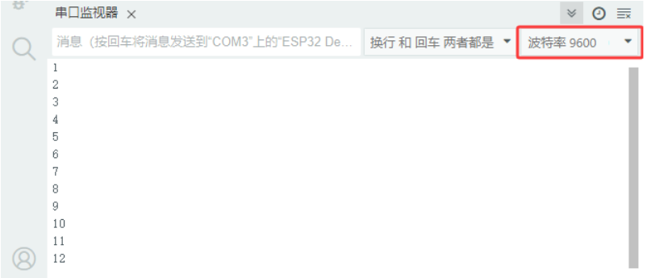

### 3.8.2 语音指令控制SK6812 RGB

⚠️ <span style="color: rgb(255, 76, 65);">**特别提醒：这里是以SK6812 RGB模块为例，你也可以使用其他模块。**</span>


⚠️ <span style="color: rgb(255, 76, 65);">**特别提醒：如果你没有SK6812 RGB模块，可以自行购买。**</span>

**接线图**

用表格和模拟图展示对应模块与扩展板或开发板的GPIO。

| 智能语音模块 | 扩展板/开发板 |
| :--: | :-----------: |
| GND  |      GND      |
| VCC  |      5V       |
| RXD  |      D4       |
| TXD  |      D5       |

| SK6812 RGB模块 | 扩展板/开发板 |
| :--: | :-----------: |
| G  |      GND      |
| V  |      3.3V      |
| S  |      D11      |

**接线模拟图**

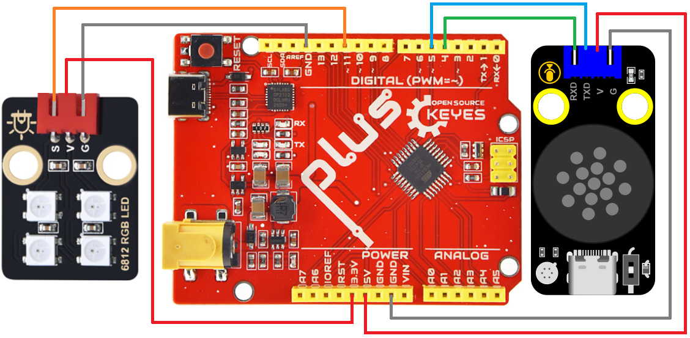

**实验代码**

```C
// 导入相关库文件
#include <SoftwareSerial.h> 
#include <Adafruit_NeoPixel.h>
#ifdef __AVR__
 #include <avr/power.h> // 需要 16 MHz Adafruit Trinket
#endif

// 定义引脚常量
const int RX_PIN = 4;   // 引脚 D4 为 RX
const int TX_PIN = 5;   // 引脚 D5 为 TX
const int LED_PIN = 11;  // SK6812 RGB模块引脚
const int LED_COUNT = 4; // 新像素数

Adafruit_NeoPixel strip(LED_COUNT, LED_PIN, NEO_GRB + NEO_KHZ800);

SoftwareSerial mySerial(RX_PIN, TX_PIN); // 定义软件串口引脚（RX, TX）

// 定义变量用于存储从语音模块接收到的控制码
volatile int Voice_Control = 0;  // 初始化为0，确保首次判断时不触发任何指令

void setup() {
  Serial.begin(9600); // 硬件串口（与电脑通信）
  mySerial.begin(9600); // 软件串口（与外设通信）

  #if defined(__AVR_ATtiny85__) && (F_CPU == 16000000)
    clock_prescale_set(clock_div_1);
  #endif

  strip.begin();           // 初始化新像素条
  strip.show();            // 关闭所有像素
  strip.setBrightness(100); // 设置亮度（最大255）
}

void loop() { 
  if (mySerial.available()) { // 检查软串口是否有来自语音模块的数据可读
    Voice_Control = mySerial.read(); // 从软串口读取多个字节的数据
    Serial.println(Voice_Control); // 将接收到的数据通过硬件串口输出到串口监视器，便于调试   
  }
  switch(Voice_Control) { // 根据接收到的指令数值,执行相应操作进行判断
    case 13: colorWipe(strip.Color(255, 0, 0), 50); break;  // 接收到的数据为13,打开红灯   
    case 14: colorWipe(strip.Color(0, 0, 0), 50); break;   // 接收到的数据为14,关闭红灯
    case 15: colorWipe(strip.Color(0, 255, 0), 50); break; // 接收到的数据为15,打开绿灯
    case 16: colorWipe(strip.Color(0, 0, 0), 50); break;   // 接收到的数据为16,关闭绿灯
    case 17: colorWipe(strip.Color(0, 0, 255), 50); break; // 接收到的数据为17,打开蓝灯
    case 18: colorWipe(strip.Color(0, 0, 0), 50); break;   // 接收到的数据为18,关闭蓝灯
    case 36: theaterChaseRainbow(50); break; // 接收到的数据为36,打开彩灯,彩虹增强型追逐型
    case 37: colorWipe(strip.Color(0, 0, 0), 50); break;   // 接收到的数据为37,关闭彩灯
  }
  // 清除指令，避免重复执行
  Voice_Control = 0;
}

// 用一种颜色填充灯带
void colorWipe(uint32_t color, int wait) {
  for(int i=0; i<strip.numPixels(); i++) { 
    strip.setPixelColor(i, color); // 设置像素颜色
    strip.show();                  // 更新灯带
    delay(wait);                   // 暂停
  }
}

// 彩虹增强剧院帐篷。在帧之间传递延迟时间（毫秒）。
void theaterChaseRainbow(int wait) {
  int firstPixelHue = 0;     // 第一个像素以红色开始（色调0）
  for(int a=0; a<30; a++) {  // 重复30次...
    for(int b=0; b<3; b++) { //  ‘b’从0到2...
      strip.clear();         //  将RAM中的所有像素设置为0（关闭）
      // “c”从“b”开始计数，以3为增量到条带的末尾…
      for(int c=b; c<strip.numPixels(); c += 3) {
        // 像素‘c’的色调被偏移一定的量，
        // 使色轮沿着条带的长度（strip. numpixels（）步骤）完整旋转一次（范围65536）：
        int hue = firstPixelHue + c * 65536L / strip.numPixels();
        uint32_t color = strip.gamma32(strip.ColorHSV(hue)); // hue -> RGB
        strip.setPixelColor(c, color); // 设置像素c的值为color
      }
      strip.show();                // 用新内容更新条带
      delay(wait);                 // 暂停一会儿
      firstPixelHue += 65536 / 90; // 一个周期的色轮超过90帧
    }
  }
}  
```

**实验结果**

按照接线图正确接好模块，选择好正确的开发板板型（Arduino Uno）和 适当的串口端口（COMxx），然后单击  按钮上传示例代码至Arduino控制板。代码上传成功后，单击Arduino IDE右上角的 ，打开串口监视器，设置串口波特率为 9600。

代码上传成功后，通过智能语音模块来控制SK6812 RGB灯。

对着智能语音模块上的麦克风，使用唤醒词 “你好，小智” 或 “小智小智” 来唤醒智能语音模块，同时喇叭播放回复语 “有什么可以帮到您”；

对着麦克风说：“打开红灯” 等命令词时，喇叭播放对应的回复语 “已为您打开红灯”，同时SK6812 RGB灯亮红色灯；

对着麦克风说：“关闭红灯” 等命令词时，喇叭播放对应的回复语 “已为您关闭红灯”，同时SK6812 RGB灯熄灭；

对着麦克风说：“打开绿灯” 等命令词时，喇叭播放对应的回复语 “已为您打开绿灯”，同时SK6812 RGB灯亮绿色灯；

对着麦克风说：“关闭绿灯” 等命令词时，喇叭播放对应的回复语 “已为您关闭绿灯”，同时SK6812 RGB灯熄灭；

对着麦克风说：“打开蓝灯” 等命令词时，喇叭播放对应的回复语 “已为您打开蓝灯”，同时SK6812 RGB灯亮蓝色灯；

对着麦克风说：“关闭蓝灯” 等命令词时，喇叭播放对应的回复语 “已为您关闭蓝灯”，同时SK6812 RGB灯熄灭；

对着麦克风说：“打开彩灯” 等命令词时，喇叭播放对应的回复语 “已为您打开彩灯”，同时SK6812 RGB灯亮彩色灯；

对着麦克风说：“关闭彩灯” 等命令词时，喇叭播放对应的回复语 “已为您关闭彩灯”，同时SK6812 RGB灯熄灭。

