# 4. Kidsblock教程

## 4.1 资料下载

请先下载Kidsblock教程所需资料（包含：示例代码 等）：[Kidsblock资料](./Kidsblock.7z)

## 4.2 Kidsblock IDE下载安装

### 4.2.1 Windows 系统 

1\. 点击官网链接：[https://www.keyesrobot.cn/zh-cn/latest](https://www.keyesrobot.cn/zh-cn/latest)

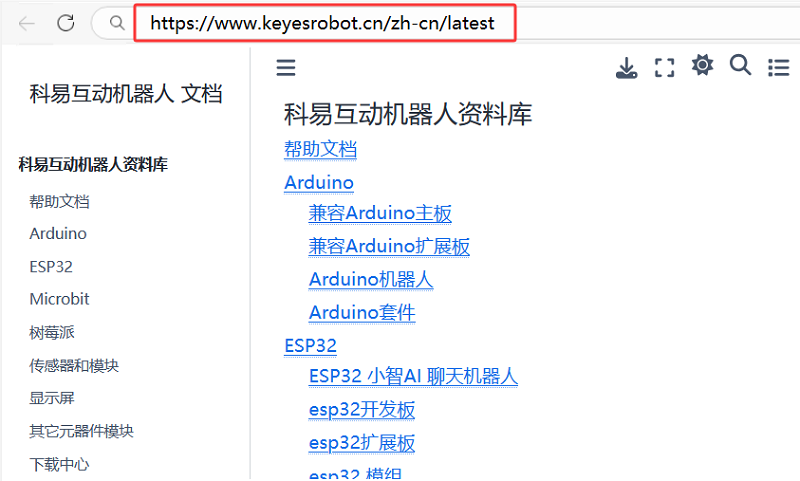

2\. 点击 “**下载中心**”，进入下载中心页面，向下滑找到 **KidsBlock软件** 部分。

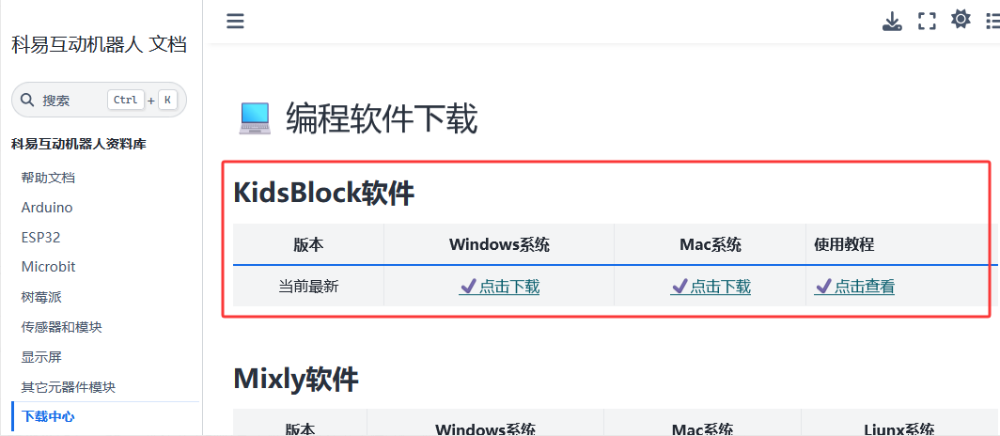

3\. 点击 **点击下载** 按钮下载 Kidsblock 软件。

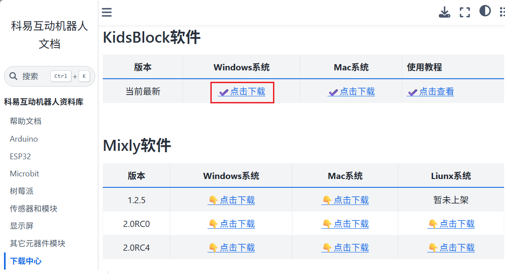

4\. 双击下载好的软件 “**KidsBlock.exe**” 。

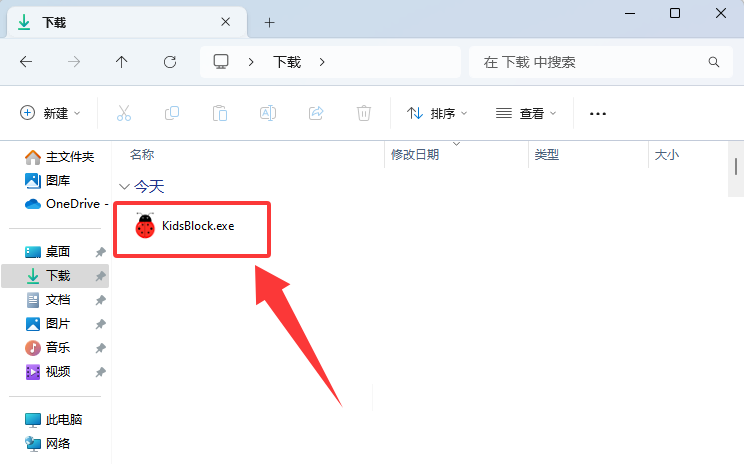

5\. 先选中 “**为使用这台电脑的任何人安装**” ，再点击 “**下一步**”。

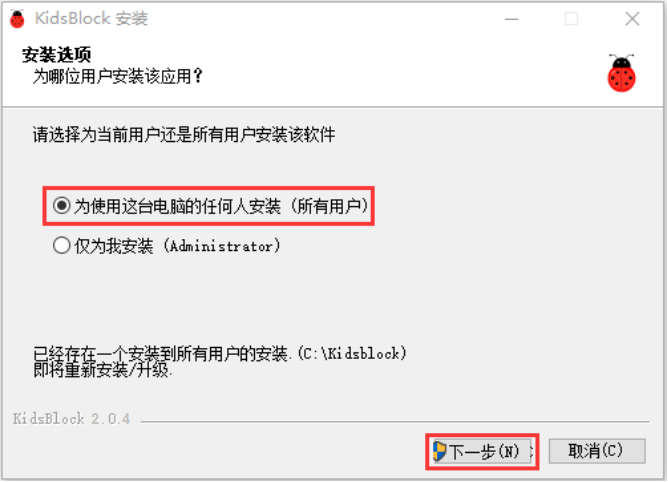

6\. 先点击 “**浏览(B)...**”，选择安装的位置（我这里选择安装在C盘，你也可以选择安装在电脑的其他盘），再点击 “**安装**”。这样，软件就在安装过程中。

7\. 几秒种后，安装完成。点击 “**完成**” 就可以打开安装好的软件。

8\. 如果出现电脑安全警报窗口，点击 “**允许访问**”。这样就可以打开了软件页面。

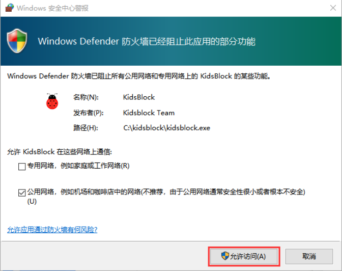

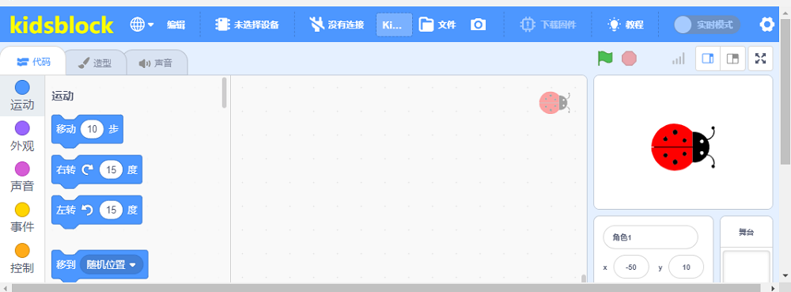

9\. 有更新软件时一般打开Kidsblock IDE页面时会自动提醒，为了软件能正常使用我们选择升级。

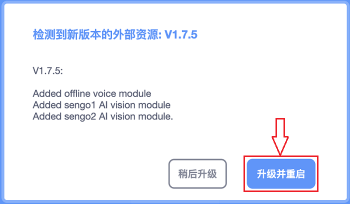

我们也可在设置中手动更新软件。

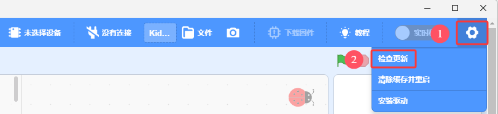

如果已经是最新版本则显示以下提示。

10\. 打开软件页面。

### 4.2.2 MacOS 系统

1\. 点击官网链接：[https://www.keyesrobot.cn/zh-cn/latest](https://www.keyesrobot.cn/zh-cn/latest)

2\. 点击 “**下载中心**”，进入下载中心页面，向下滑找到 **KidsBlock软件** 部分。

3\. 点击 **点击下载** 按钮下载 Kidsblock 软件。

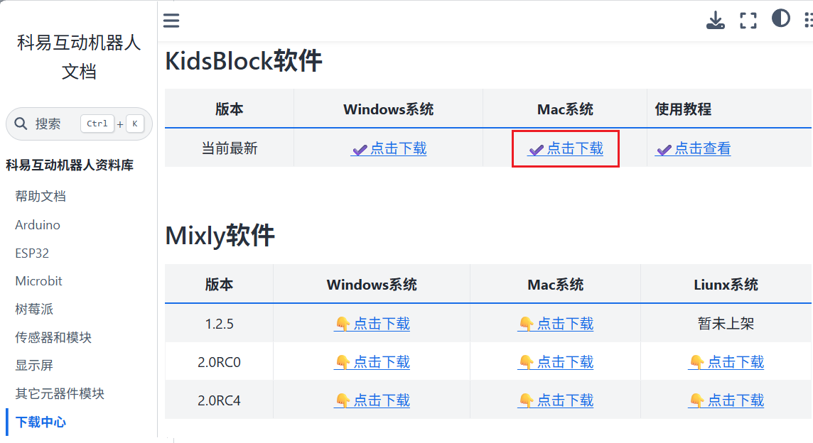

4\. 双击下载好的软件文件 “**KidsBlock.dmg**”。

5\. 双击之后，出现如下图。

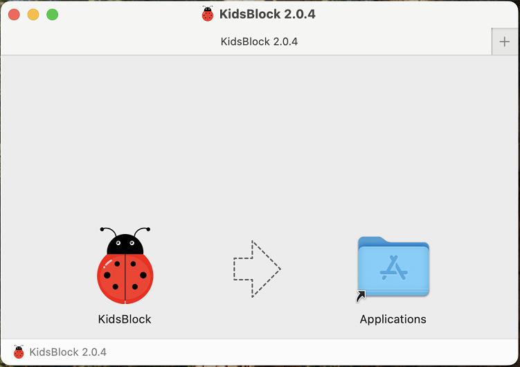

6\. 按住鼠标左键将 “**KidsBlock**” 拖动到 **Applications** 文件夹中。

7\. “**KidsBlock**” 在复制拷贝至 **Applications** 文件夹过程中，有可能会出现 “**安全提醒**” 框 。

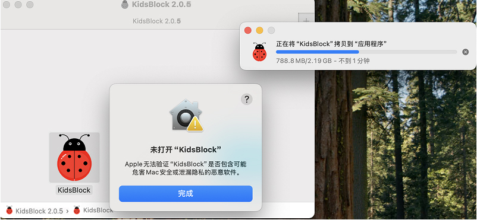

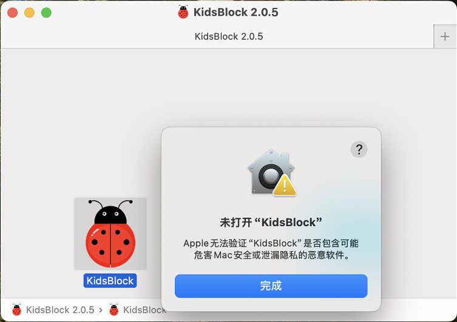

8\. 先点击电脑的 “**设置**”，找到 “**隐私与安全性**” 并且点击它；然后找到 “**仍要打开**” 并且点击它，出现 “ **打开“KidsBlock”？**”对话框，最后点击 “**仍要打开**” 按钮。

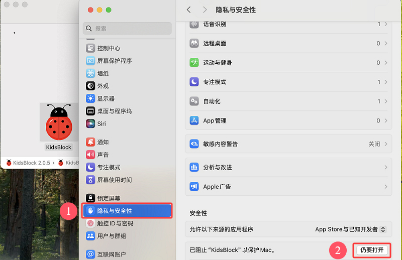

9\. 出现 “**隐私与安全性**”对话框，在对话框中输入好 “**管理员用户名**” 和 “**密码**”，然后单击 “**好**” 按钮。

10\. 如果提示更新，请点击更新按钮获取最新版本KidsBlock。

11\. 过一会儿，您就可以打开 Kidsblock 页面了。

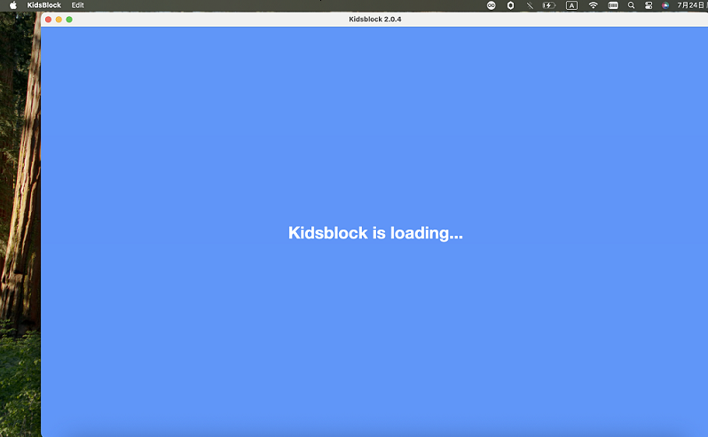

## 4.3 KidsBlock软件的使用方法

⚠️ **特别提醒：** 以下是以Windows系统为例，MacOS系统可以参考。

### 4.3.1 驱动安装

如果驱动程序已经在计算机上安装好了，那么您就无需再进行安装了。如果没有安装，那么您需要按照以下步骤操作。

1\. 点击选择“**安装驱动**”。

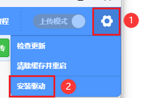

2\. 进入设备驱动程序安装向导，然后点击“**下一页**”。

3\. 点击“**完成**”。

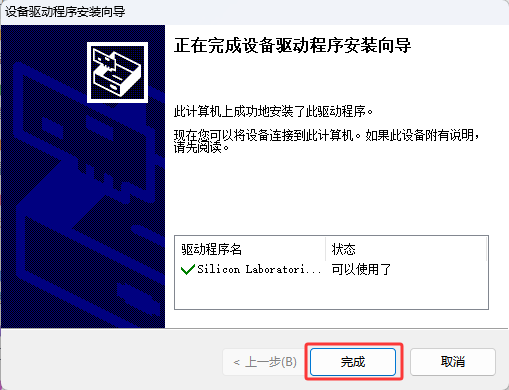

4\. 点击“**下一页**”。

5\. 点击“**完成**”。

6\. 如果出现警告，只需点击“**允许程序所有操作**”和“**安装**”。

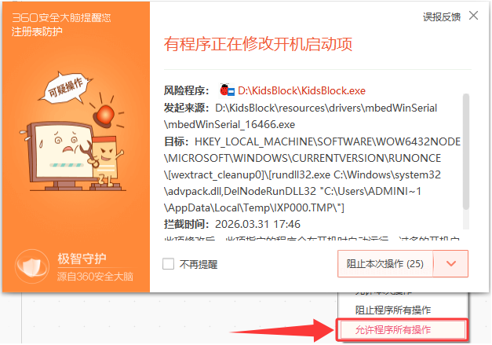

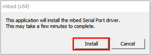

7\. 点击“**完成**”。

8\. 点击“**Extract**”。

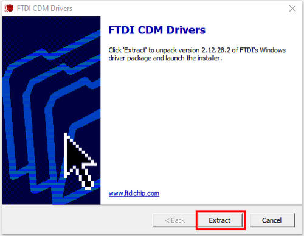

9\. 点击“**下一页**”。

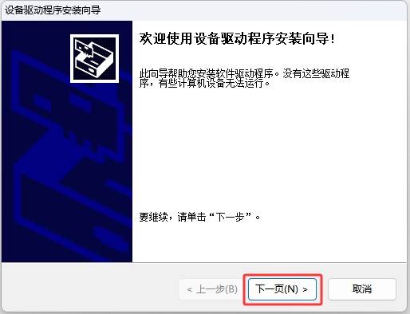

10\. 勾选“**我接受这个协议(A)**”，然后点击“**下一页**”。

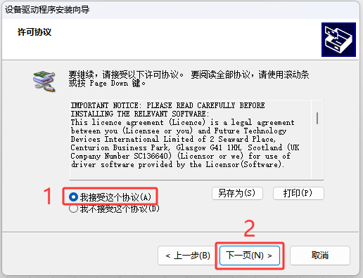

11\. 点击“**完成**”。

12\. 点击“**安装**”。

13\. 安装驱动程序完成后，点击“**确定**”.

### 4.3.2 选择设备

1\. 确保ESP32主控板与计算机连接成功，然后双击 “**KidsBlock**” 图标打开KidsBlock软件。

2\. 单击，如下图所示：

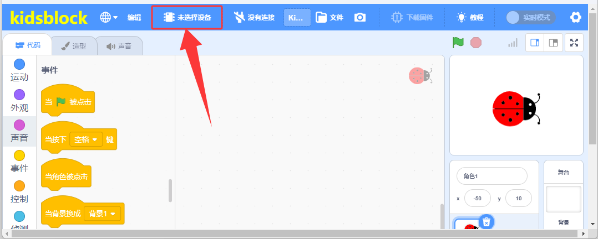

3\. 由于本教程使用的是 Keyes Plus development board 设备，所以选择 “**Keyes Plus development board**” 设备，如下图所示：

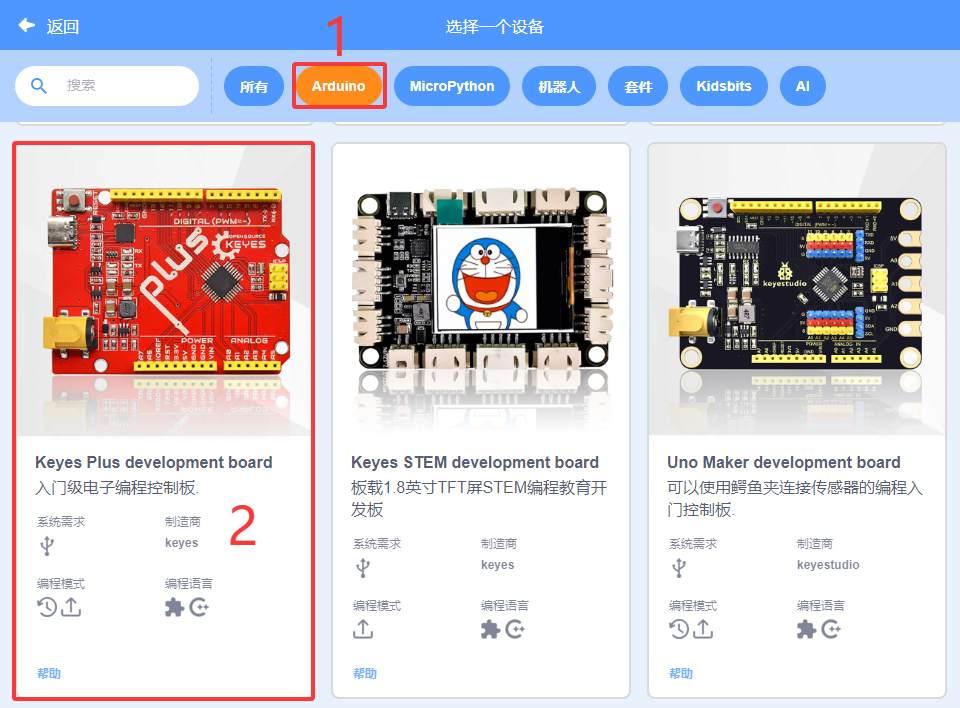

4\. 连接串口端口，点击 “**连接**”，如下图所示：

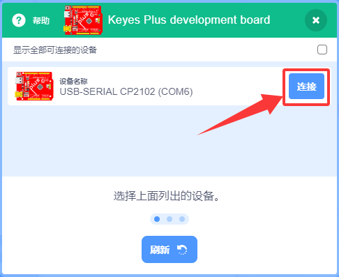

5\. 然后单击 “**返回编辑器**” 返回代码编辑区，如下图所示：

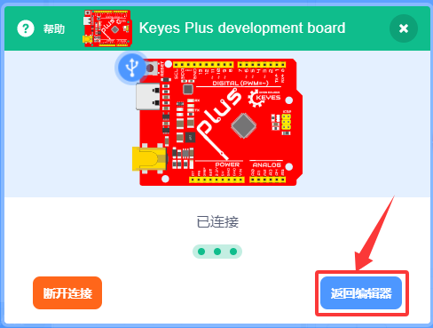

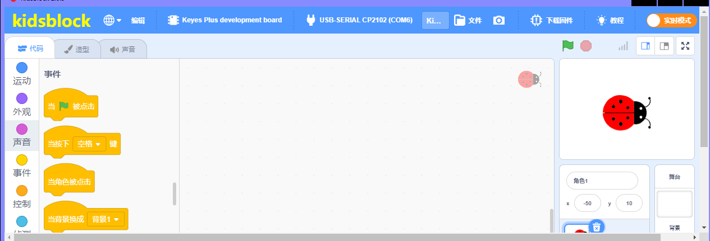

6\. 点击  ，将实时模式  切换成上传模式 ，如下图所示：

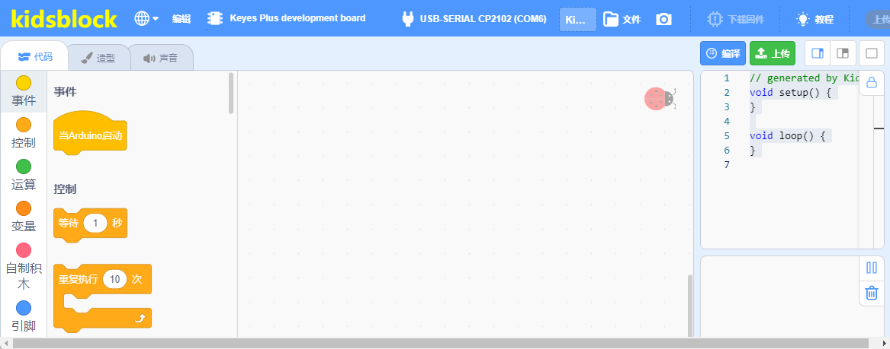

### 4.3.3 软件界面介绍

了解KidsBlock软件界面，有利于代码编程的学习，如下图所示：

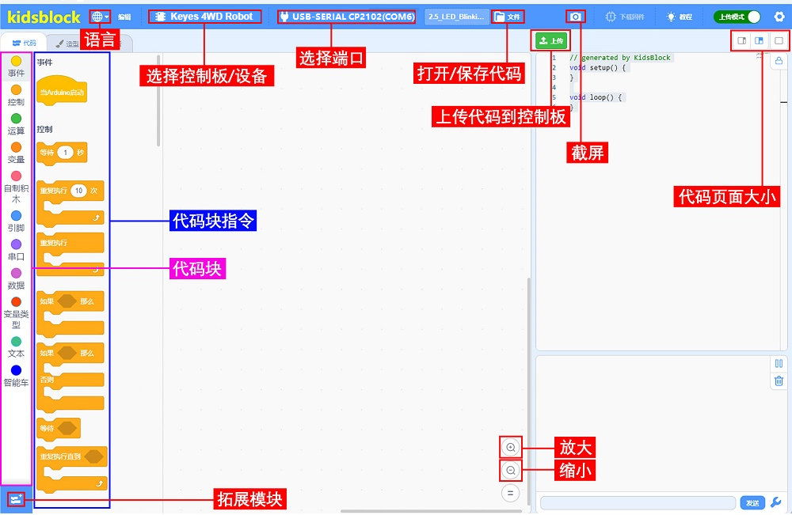

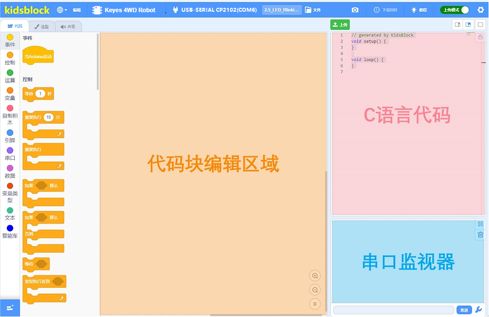

### 4.3.4 添加库文件

⚠️ **特别提醒：如果是自己拖动代码块来编写代码，这部分内容一定要操作；如果是使用我们提供的示例代码，这一步骤可以跳过。**

点击

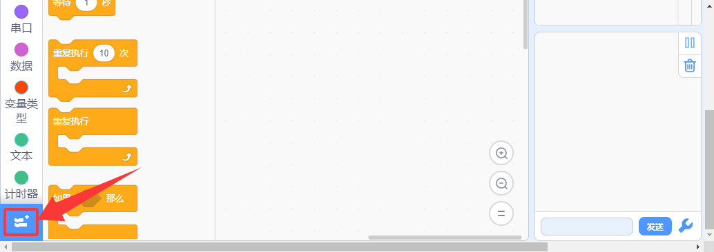

先点击 `AI` ，再点击选中 `语音识别模块`。这样，`语音识别模块` 库文件添加成功了。

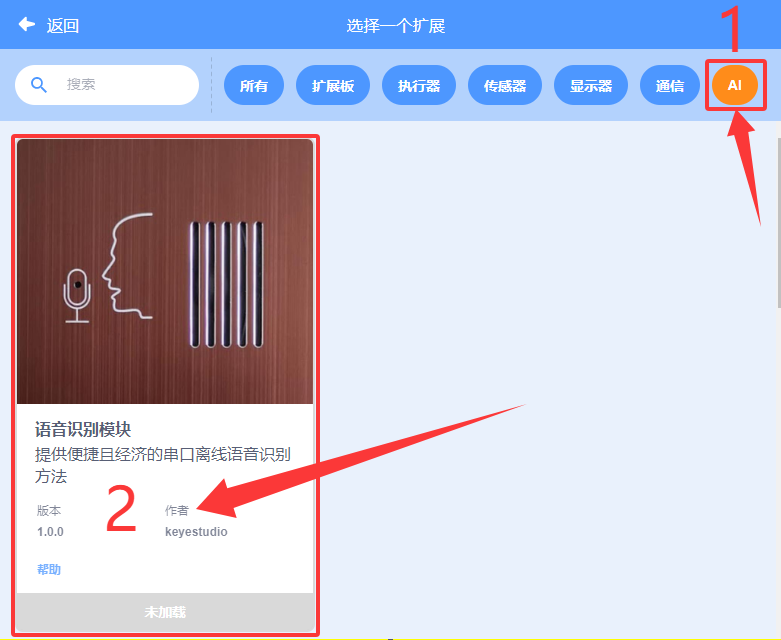

先点击 `显示器` ，再点击选中 `NeoPixel彩灯`。这样，`NeoPixel彩灯` 库文件添加成功了。

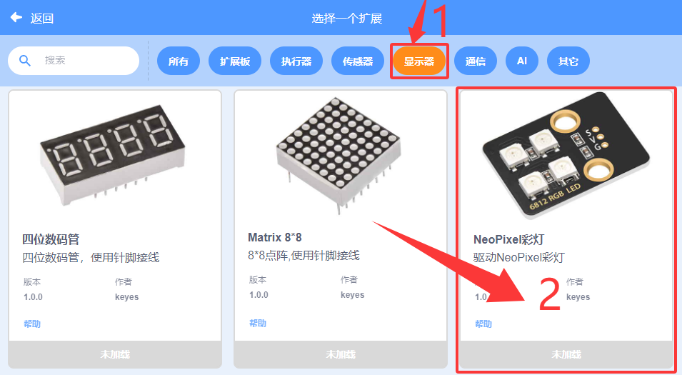

点击 `返回` ，在代码块一栏可以看到添加成功的 “**语音识别**” 库 和 “**RGBLED灯条**” 库。

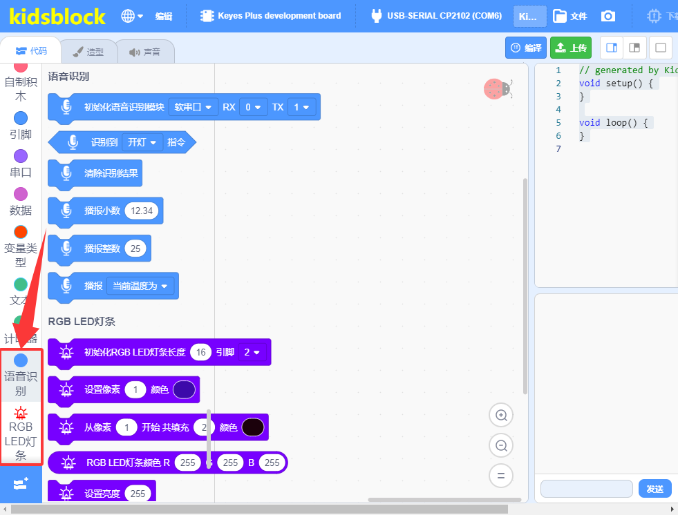

### 4.3.5 编写代码并上传

确保Arduino主控板与计算机连接成功，然后双击 “ **KidsBlock** ” 图标打开KidsBlock软件。

单击 “**文件**” --> “**从电脑中上传**”，然后选择代码所在的路径（在 `资料下载`中下载的文件解压），选中代码文件打开即可，如下图所示：

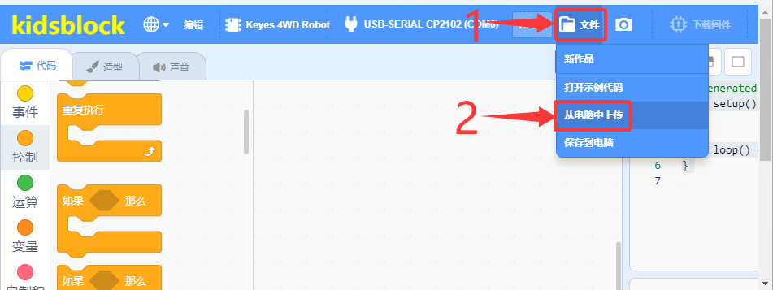

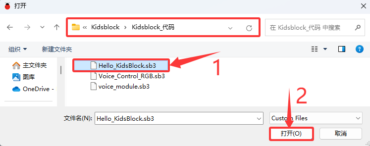

代码文件打开后，需要手动连接串口端口，如下图所示：

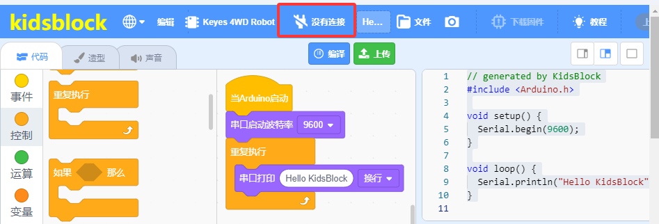

然后单击 “**返回编辑器**” 返回代码编辑区，如下图所示：

单击将代码上传到Arduino主控板。

代码上传成功后，点击  设置串口波特率为9600。

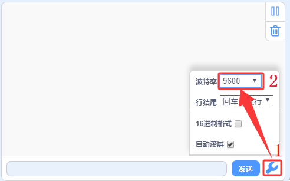

这样，可以看到串口监视器循环打印 “Hello KidsBlock”。

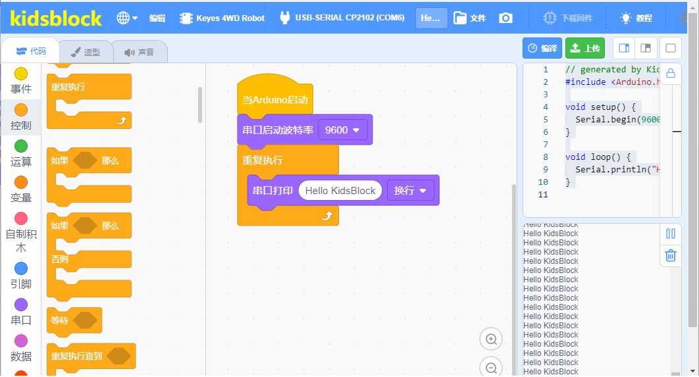

---------------

## 4.4 与Arduino开发板配合使用（以主控板Arduino Uno 板型为例）

### 4.4.1 读取语音指令

**接线图**

用表格和模拟图展示对应模块与扩展板或开发板的GPIO。

| 智能语音模块 | 扩展板/开发板 |
| :--: | :-----------: |
| GND  |      GND      |
| VCC  |      5V       |
| RXD  |      D4       |
| TXD  |      D5       |

**接线模拟图**

**实验代码**

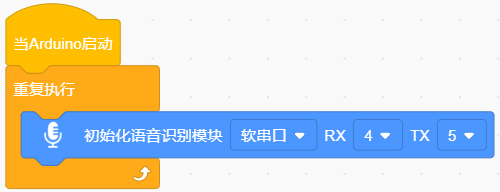

**实验结果**

按照接线图正确接好模块，选择好正确的开发板（Keyes Plus development board）和 适当的串口端口（COMxx），然后单击  按钮上传示例代码至Arduino控制板。代码上传成功后，在Kidsblock IDE右下角的串口监视器窗口中单击 ，设置串口波特率为 9600。

对着智能语音模块上的麦克风，使用唤醒词 “你好，小智” 或 “小智小智” 来唤醒智能语音模块，同时喇叭播放回复语 “有什么可以帮到您”；接下来即可通过串口打印窗口查看智能语音模块接收到语音命令词所对应的命令码 等。

语音模块唤醒后，对着麦克风说：“打开台灯” 或 “请开灯” 或 “开灯” 或 “打开灯” 或 “我回来了”等命令词时，串口打印命令参数 “1”，同时喇叭播放对应的回复语 “已为您打开照明”。

对着麦克风说：“关闭台灯” 或 “请关灯” 或 “关灯” 或 “睡觉了” 或 “关上灯” 或 “我出去了”等命令词时，串口打印命令参数 “2”，同时喇叭播放对应的回复语 “已为您关闭照明”。

对着麦克风说：“调亮一点” 或 “亮一点”等命令词时，串口打印命令参数 “3”，同时喇叭播放对应的回复语 “灯光已调亮”。

对着麦克风说 “调暗一点” 或 “暗一点”等命令词时，串口打印命令参数 “4”，同时喇叭播放对应的回复语 “灯光已调暗”。

其他的这里就不一一分别陈述，请查看 **产品介绍** 所列的语音识别指令和语音播报指令，所对应的命令码和信息号。

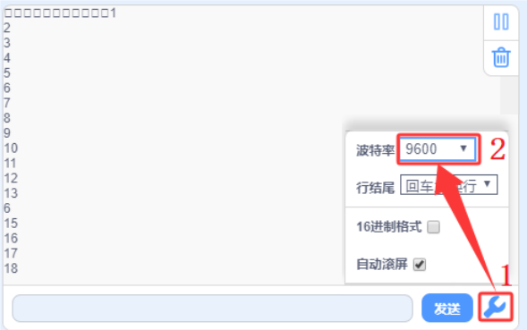

### 4.4.2 语音指令控制SK6812 RGB

⚠️ **特别提醒：这里是以SK6812 RGB模块为例，你也可以使用其他模块。**

⚠️ **特别提醒：如果你没有SK6812 RGB模块，可以自行购买。**

**接线图**

用表格和模拟图展示对应模块与扩展板或开发板的GPIO。

| 智能语音模块 | 扩展板/开发板 |
| :--: | :-----------: |
| GND  |      GND      |
| VCC  |      5V       |
| RXD  |      D4       |
| TXD  |      D5       |

| SK6812 RGB模块 | 扩展板/开发板 |
| :--: | :-----------: |
| G  |      GND      |
| V  |      3.3V      |
| S  |      D11      |

**接线模拟图**

**实验代码**

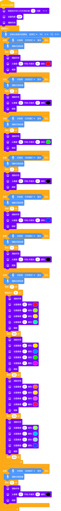

**实验结果**

按照接线图正确接好模块，选择好正确的开发板（Keyes Plus development board）和 适当的串口端口（COMxx），然后单击  按钮上传示例代码至Arduino控制板。代码上传成功后，在Kidsblock IDE右下角的串口监视器窗口中单击 ，设置串口波特率为 9600。

代码上传成功后，通过智能语音模块来控制SK6812 RGB灯。

对着智能语音模块上的麦克风，使用唤醒词 “你好，小智” 或 “小智小智” 来唤醒智能语音模块，同时喇叭播放回复语 “有什么可以帮到您”；

对着麦克风说：“打开红灯” 等命令词时，喇叭播放对应的回复语 “已为您打开红灯”，同时SK6812 RGB灯亮红色灯；

对着麦克风说：“关闭红灯” 等命令词时，喇叭播放对应的回复语 “已为您关闭红灯”，同时SK6812 RGB灯熄灭；

对着麦克风说：“打开绿灯” 等命令词时，喇叭播放对应的回复语 “已为您打开绿灯”，同时SK6812 RGB灯亮绿色灯；

对着麦克风说：“关闭绿灯” 等命令词时，喇叭播放对应的回复语 “已为您关闭绿灯”，同时SK6812 RGB灯熄灭；

对着麦克风说：“打开蓝灯” 等命令词时，喇叭播放对应的回复语 “已为您打开蓝灯”，同时SK6812 RGB灯亮蓝色灯；

对着麦克风说：“关闭蓝灯” 等命令词时，喇叭播放对应的回复语 “已为您关闭蓝灯”，同时SK6812 RGB灯熄灭；

对着麦克风说：“打开彩灯” 等命令词时，喇叭播放对应的回复语 “已为您打开彩灯”，同时SK6812 RGB灯亮彩色灯；

对着麦克风说：“关闭彩灯” 等命令词时，喇叭播放对应的回复语 “已为您关闭彩灯”，同时SK6812 RGB灯熄灭。

