# 5. Mixly教程

## 5.1 资料下载

请先下载Mixly教程所需资料（包含：示例代码 等）：[Mixly资料](./Mixly.7z)

## 5.2 Mixly软件下载

1\. 点击官网链接：[https://www.keyesrobot.cn/zh-cn/latest](https://www.keyesrobot.cn/zh-cn/latest)

2\. 点击 “**下载中心**”，进入下载中心页面，向下滑找到 **Mixly软件** 部分。

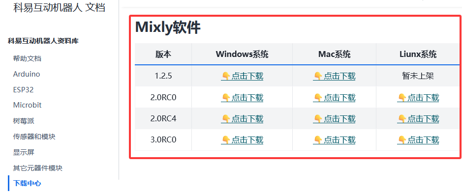

3\. 本教程选用**3.0RC0版本**，根据自己电脑系统下载软件，点击 **点击下载** 按钮下载 Mixly3.0 软件。

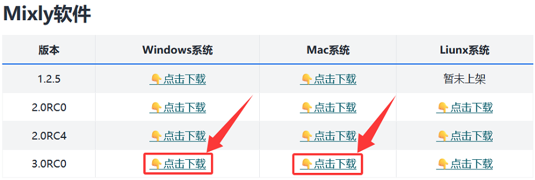

4\. Windows 系统下载 “Mixly3.0-win32-x64一键更新版.zip” 版本的压缩包为例。

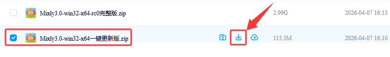

Mac 系统下载 “Mixly3.0-win32-x64一键更新版.zip” 版本的压缩包为例。

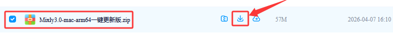

## 5.3 软件安装

### 5.3.1 Windows 系统

1\. 将下载好的压缩包存放到你需要安装软件的位置（**压缩包保存到非中文路径（如 D:\），不要直接下载到电脑桌面上**），然后解压（注意：解压后文件名后面的"一键更新版"的中文字样要删除掉，以及安装路径也不能存在中文，否则上传代码可能会报错）。

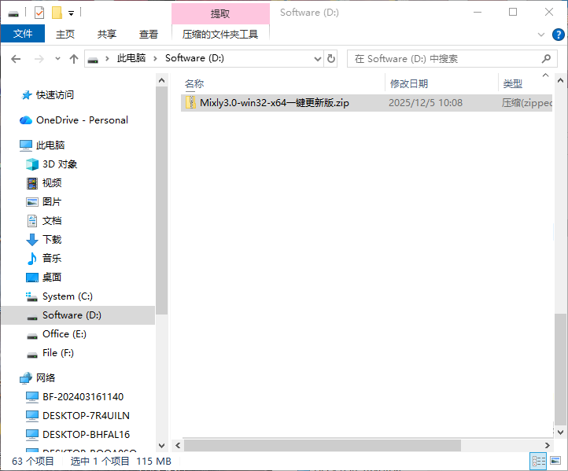

2\. 解压压缩包，打开文件夹，点击打开 “**一键更新**” 文件。

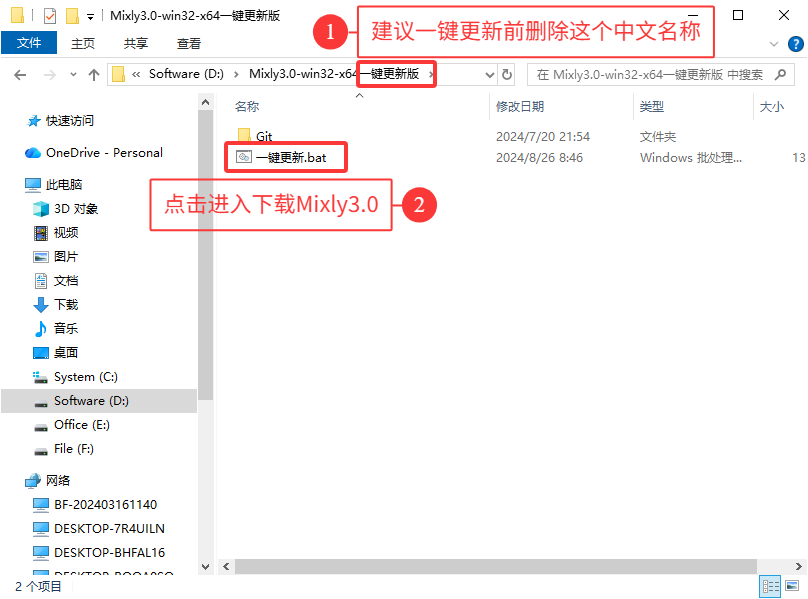

3\. 需要输入的地方全部输入“**y**”，等待更新即可。操作完后耐心等待下载完成，下载更新完毕后，出现 `请按任意键键继续...` 时，即可按任意键退出。
⚠️ **特别注意：** 安装和使用 Mixly 时，**建议暂时关闭Windows Defender或其他杀毒软件，并将Mixly3.0-win32-x64的整个文件夹添加到杀毒软件的信任列表（排除项）中。** 这能有效避免更新失败、文件被误删或编译缓慢等问题。

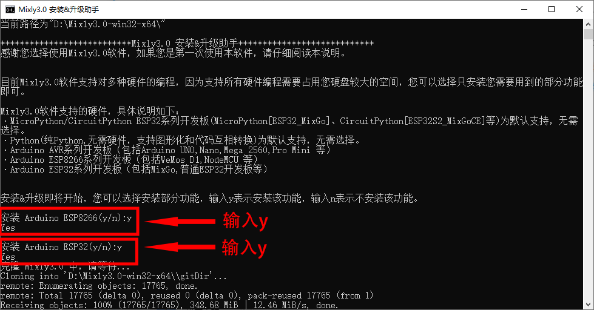

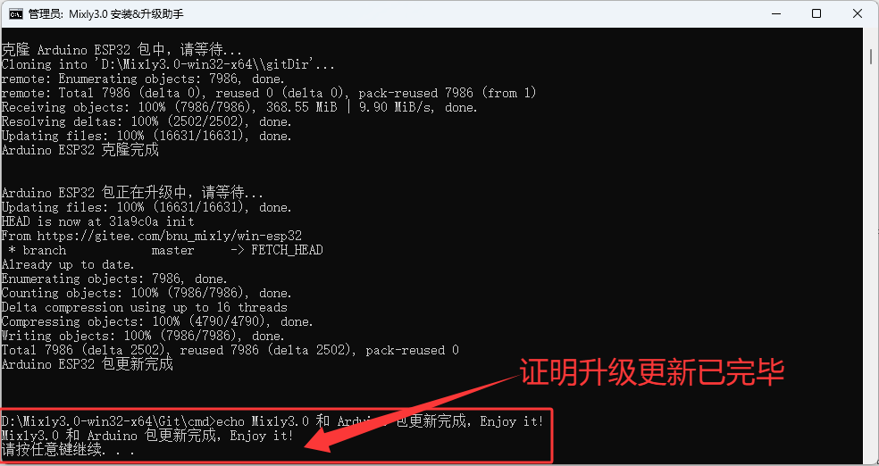

**注意：** 如果电脑上已经装有360安全卫士杀毒软件，mixly3.0安装升级更新过程中，会出现安全提示，请选择 “**允许程序所有操作**” 。

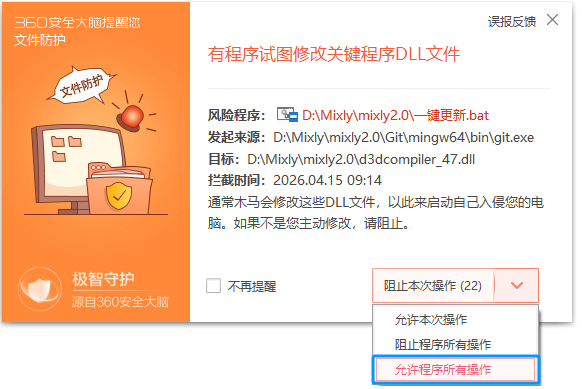

4\. 再次打开文件夹，可以看到软件已存在，点击Mixly.exe可以打开Mixly IDE。

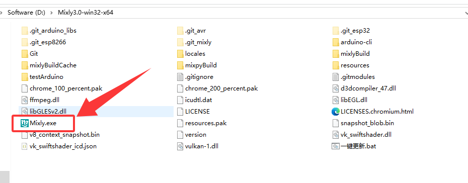

### 5.3.2 Mac 系统

1\. 将下载好的压缩包放到软件存放的文件夹中。

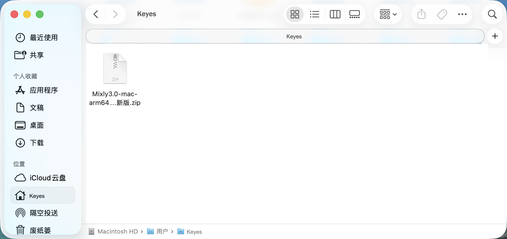

2\. 双击 “**.zip**” 文件解压，并删除解压后文件夹中的 “**一键安装版**” 字样，因为Mixly软件的安装路径不能存在中文，否则可能会出报错。

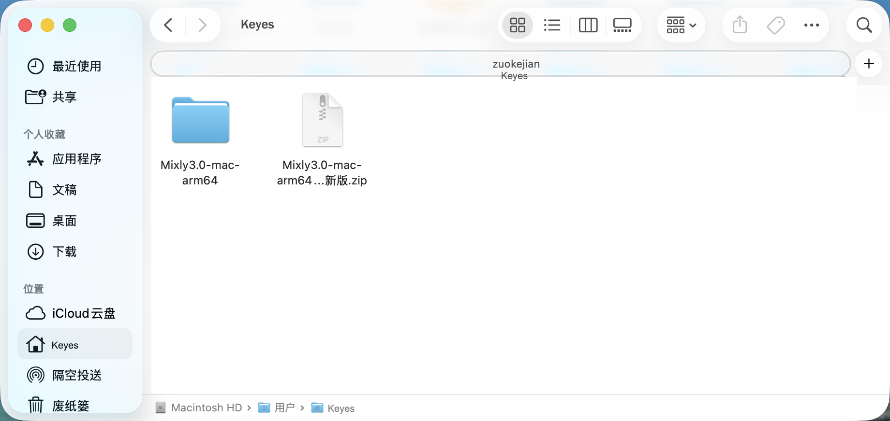

3\. 进入文件夹 `Mixly3.0-mac-arm64`，点击 `git-2.15.0-intel-universal-mavericks.dmg` 文件进行安装Git，这个是必须的。

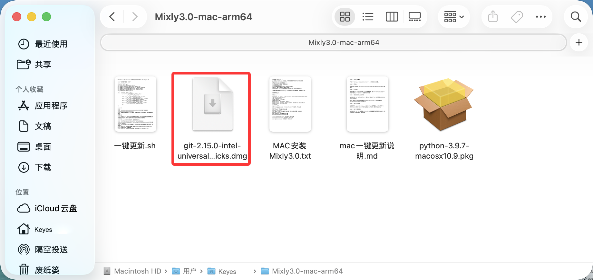

4\. 打开终端。使用快捷键 **`command+空格`** 打开聚焦搜索，输入 **`terminal.app`** 并选中匹配项，按下 **`Enter`** 键后即可打开终端。

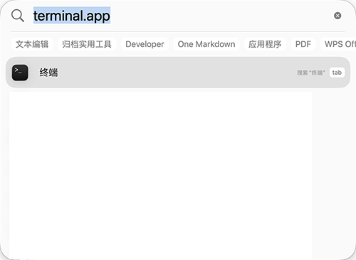

5\. 进入文件夹路径，在终端中输入 **`cd [path]`** ，其中 **`[path]`** 为所解压的mixly3.0更新文件夹路径。

例如：当前mixly3.0文件夹路径为 /Users/Keyes/mixly3.0-mac-arm64，则对应指令为 **`cd /Users/Keyes/mixly3.0-mac-arm64`** ，然后按回车键(即: Enter键)即可。

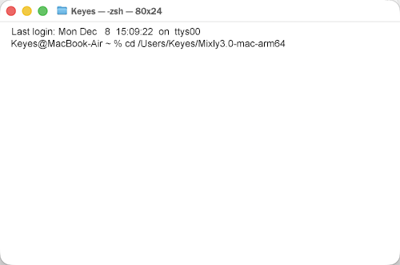

6\. 开启root权限。在终端中输入 **`sudo su`** ，然后按回车键(即: Enter键)再按照提示输入密码 **`Password：`** 即可开启root权限。

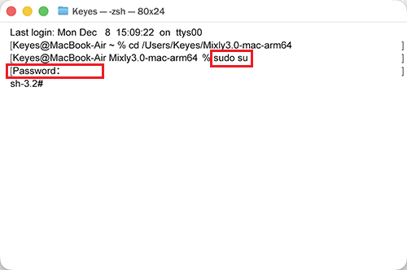

7\. 在终端运行 `一键更新` 脚本。在终端中输入 **`sh 一键更新.sh`** ，按回车键(即: Enter键)后根据提示选择需要安装的板卡，然后等待完成，安装完成后，关闭终端。(注意：以下操作必须在root下执行，否则可能会出错。)

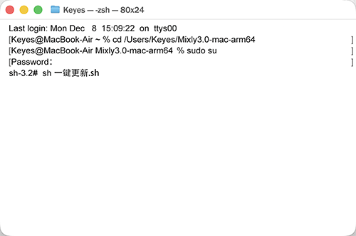

8\. 确认安装开发板

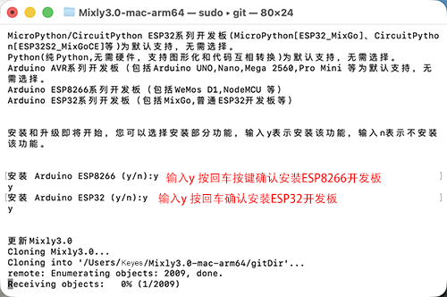

9\. 下载并更新完成

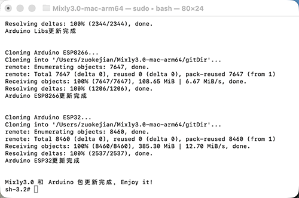

10\. 双击Mixly图标即可进入软件。

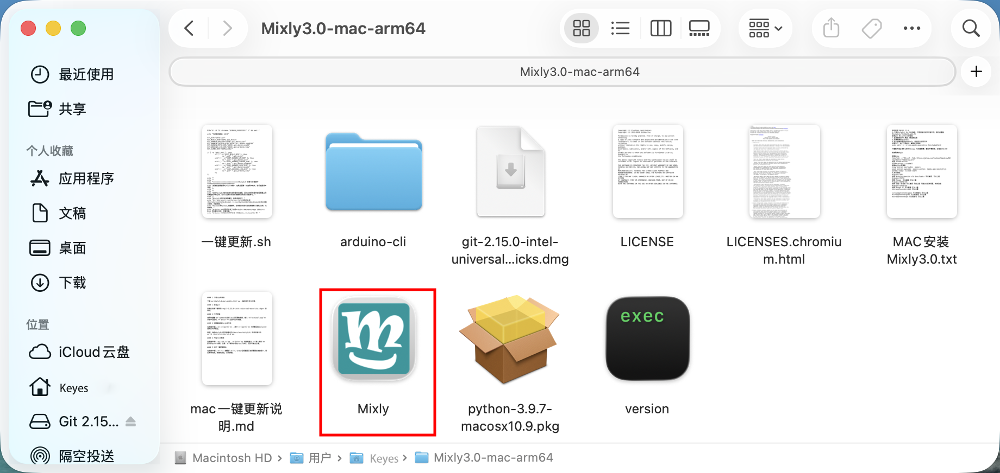

## 5.4 软件介绍

1\. 在存放的 Mixly3.0-win32-x64 文件夹中，这里双击 “**Mixly.exe**” 就能打开 Mixly3.0 软件。如下图所示：

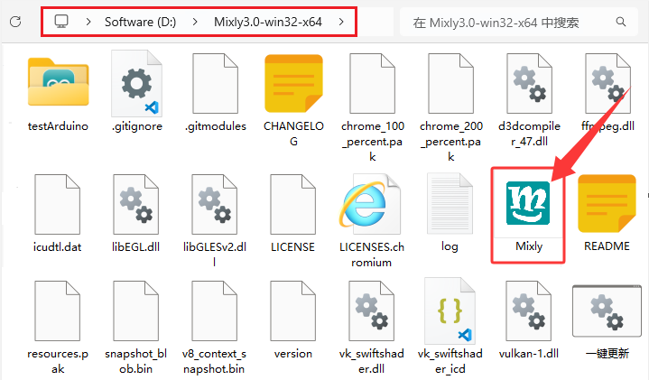

2\. 打开软件后，通过左右两边的箭头图片切换开发板页面，我们找到 **Arduino AVR开发板**。

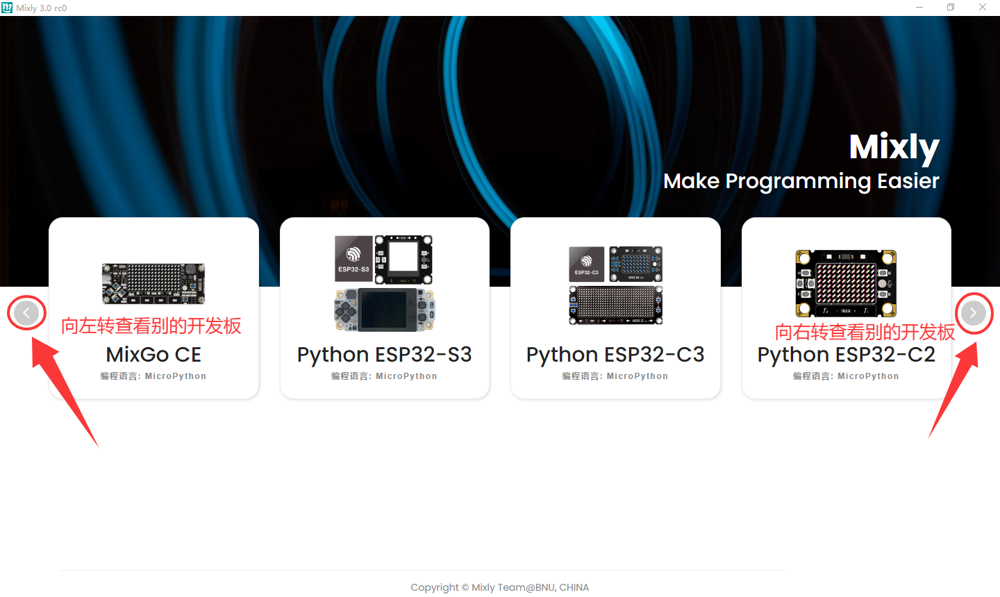

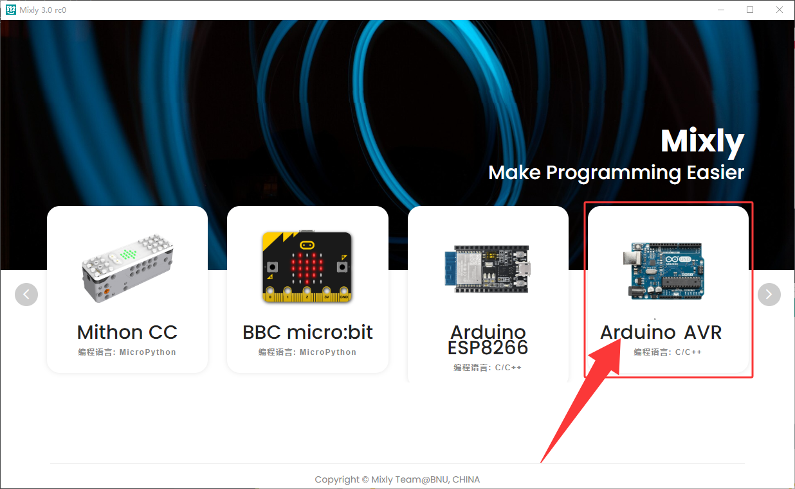

3\. “ **Arduino AVR** ” 就可以进入Mixly编程界面。软件界面如下图所示：

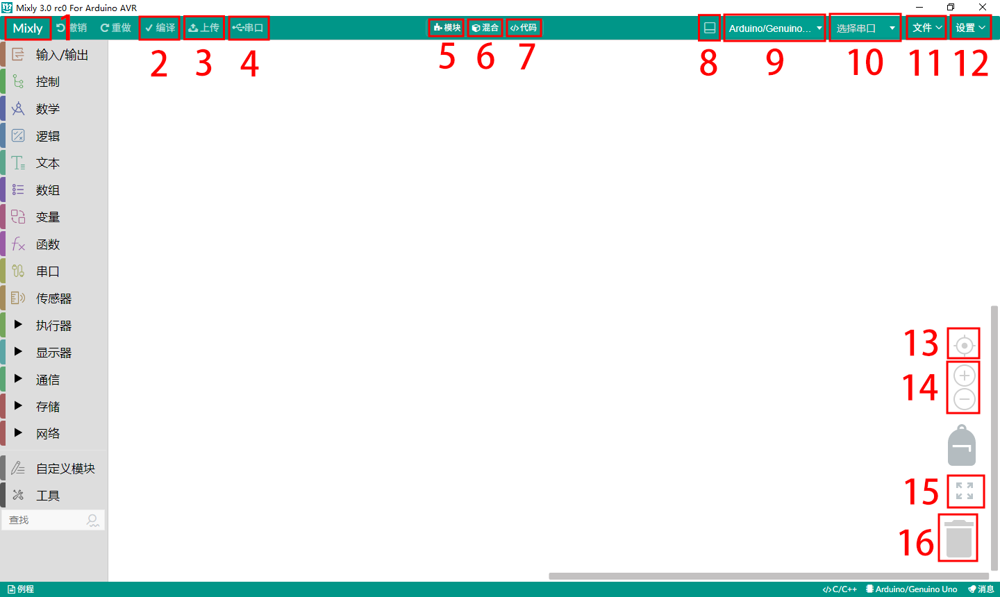

-  1：返回主页面，点击可返回到选择开发板的页面。
-  2：编译代码，检查代码是否存在错误。编译代码可以不用连接开发板，这需要选择好开发板的板型就可以。也就是说，如果编译代码成功，而上传代码失败，可能问题就出在开发板上。
-  3：上传代码，上传前会自动编译代码，编译成功则会上传代码到开发板中。
-  4：串口打印，点击可进入串口打印窗口，需要连接开发板并选择正确的端口才能使用。
-  5：模块模式，代码以模块形态展示。
-  6：混合模式，使用代码模块搭建的代码会在右侧展示对应的Arduino C代码。
-  7：代码模式，使用代码块搭建的代码会全屏显示为Arduino C代码。
-  8：打开状态栏，点击会在米思齐下方打开一个状态栏，关闭也是点击它即可。
-  9：选择开发板，点击它可以选择使用Arduino ESP32框架的开发板常见的有ESP32 dev Module，ESP32 Pico Kit等。
- 10：选择串口，点击它可以选择连接到开发板的USB串口端口，只有选择了正确的串口编号才能上传代码到开发板中。
- 11：文件，点击它可以进行以下操作---打开代码文件，新建代码文件，保存代码文件，另存为代码文件，导出库。
- 12：设置，点击它可以进行以下操作---管理库（导入库文件，删除库文件)，反馈（如果你发行软件的问题可以反馈给官方)，文档（米思齐官方提供的软件使用教程，更深入的了解米思齐的最佳途径)。
- 13：代码块大小正常化并居中。
- 14：放大以及缩小代码块按键。
- 15：在代码编辑区显示所有代码块。
- 16： 删除代码块，将代码块拖到该图标上方即可删除代码块，还有一种删除代码块的方法就是将代码块拖到代码显示栏上鼠标手会出现一个红色的“x”代表删除。

**最后还要补充两点：**

第一点: Mixly支持多国语言，我们可以通过如下界面找到并且点击  进入个性化设置页面，找到语言下面的简体中文下拉菜单，选择不同的语言版本，此时这个下拉菜单显示的是简体中文，如下图所示：

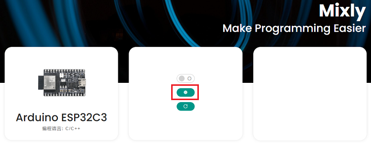

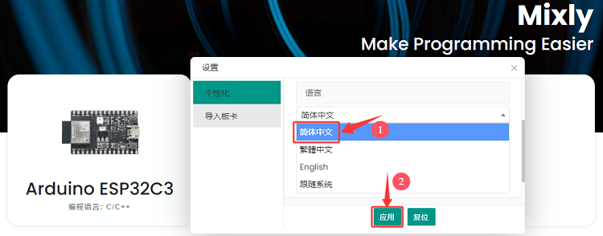

第二点: 在界面最上方右侧有一个  按钮，单击这个按钮就能进入纯代码形式，如下图所示：

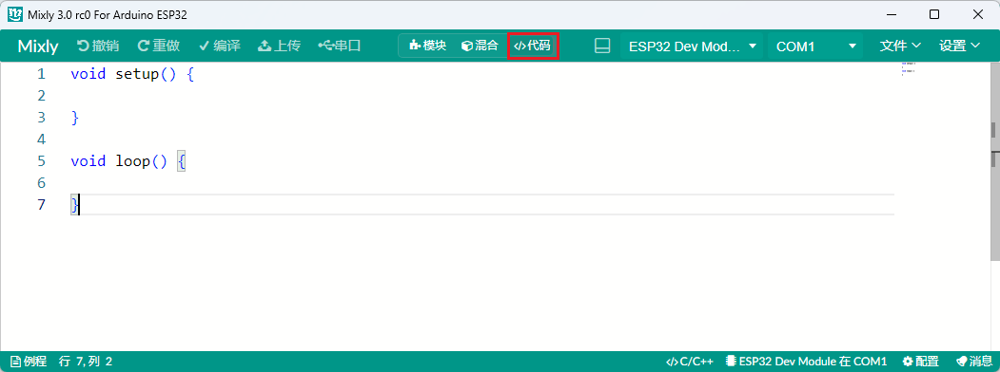

Mixly作为一款将图形化编程方式和代码编程方式融合在一起的开发环境，如果只能单独地显示代码或显示图形程序块，那么肯定是不够好的。在Mixly中是能够将代码和图形程序块一起呈现在屏幕上的，这个功能可以通过界面最上方右侧有一个按钮实现，单击这个  按钮之后，如下图所示：

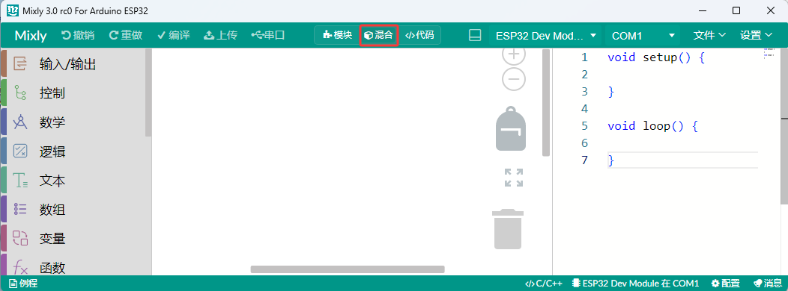

这时，在程序构建区的右侧会显示出对应的代码，这段代码是与程序构建区中的模块所组成的程序块对应的，会随着模块的变化而变化，不过区域中的代码是不可编辑的。同时，界面最右侧那个向左的箭头按钮变成了向右的箭头。

⚠️ **注意：想了解更多关于Mixly相关知识的请点击链接：** [https://mixly.readthedocs.io/zh-cn/latest/](https://mixly.readthedocs.io/zh-cn/latest/) 。

## 5.5 添加Mixly库文件(**重要**)

⚠️ **注意：Mixly 库文件必须添加好，否则后面涉及到相关模块的示例代码是打不开的**。

**特别提醒：** Mixly_库文件在**Mixly**文件夹提供有，请下载并且安装好Mixly库文件。

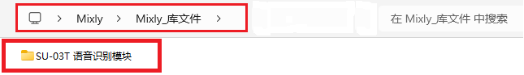

Mixly3.0软件下载安装后，点击 **Arduino AVR** 进入代码编辑器，先点击右上角 “**设置**”，再点击 “**管理库**” 进入添加库文件界面。如下图所示：

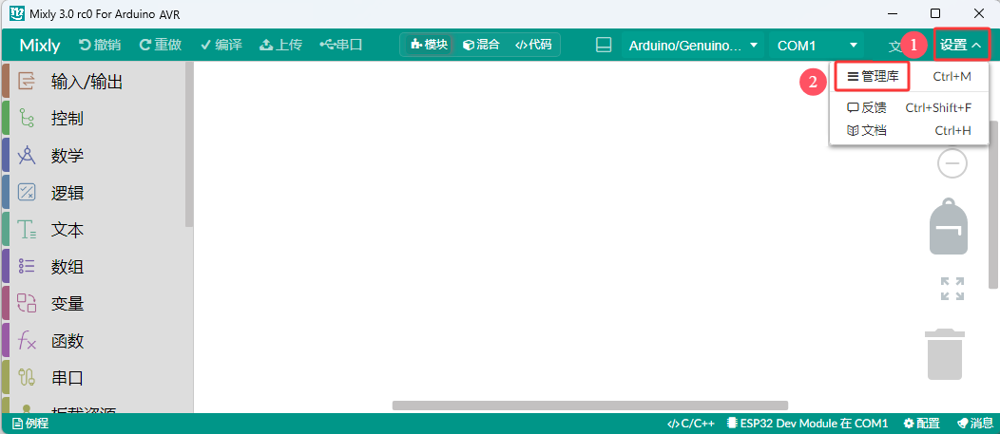

进入添加库文件界面后，选择本地导入，先点击 “ **导入库** ” ，再点击  进入库文件所放的位置。

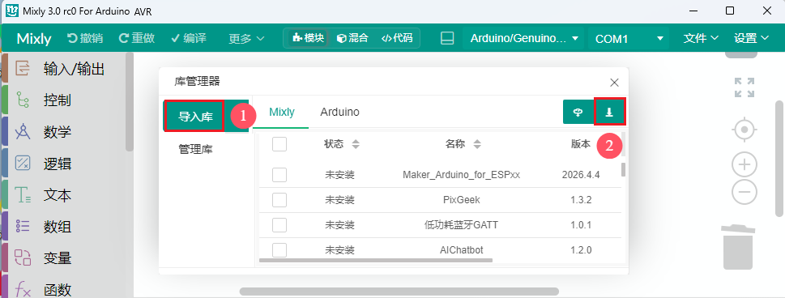

找到存放库文件夹，再选中库文件中的 **index.xml** 的文件，然后单击 “ **确定** ”。之后，就可以看到库文件在导入中，一会儿出现 “**导入成功**” 字样，说明库文件导入成功。如下图所示：

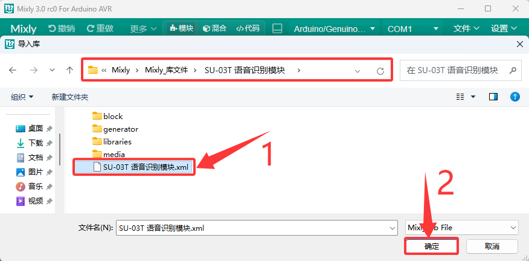

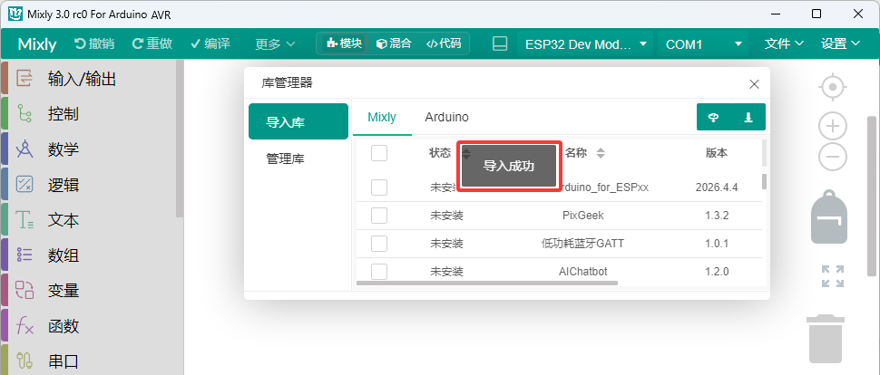

点击 “**管理库**”，可以看到添加成功的库文件。如下图所示：

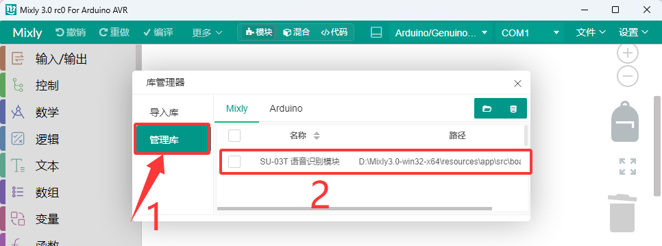

关闭添加库文件的窗口界面，在代码编辑器左侧看到刚刚添加的库文件。如下图所示：

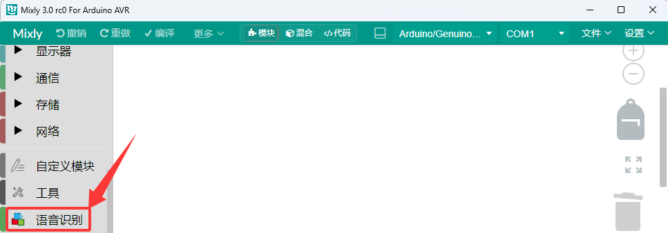

## 5.6 编写代码并上传 

⚠️ **特别注意：后面的示例代码上传步骤也一样，可以参考**。

确保Arduino开发板与计算机连接成功，然后双击 “ **Mixly.exe** ” 图标打开Mixly软件。

从电脑上打开已经编写好的示例代码，如下图所示： 

将我们提供的代码文件压缩包解压，把解压后的代码文件夹保存到方便使用的位置。我们提供本课程需要用到的所有代码文件，并保存到方便使用的位置。本课程以代码存放于电脑桌面上为例，路径为 <u>C:电脑\桌面\Mixly\Mixly_代码</u>。（**你也可以放入其他磁盘，只要方便示例代码导入就行**）

单击“ **文件** ” --> “ **打开** ”，然后选择保存代码的路径，选中代码文件打开即可。如下图所示：

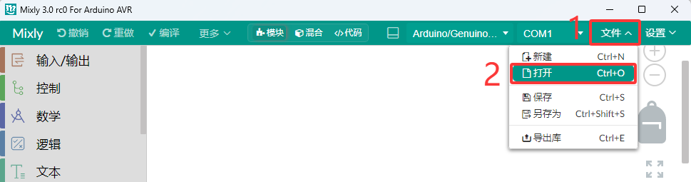

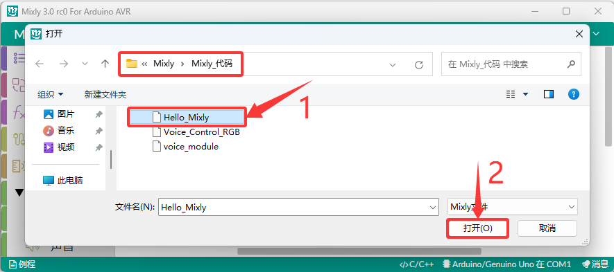

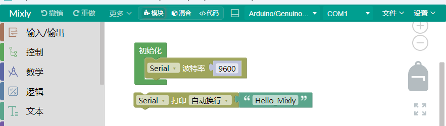

代码文件打开后，需要手动选择Arduino主控板的板型 “ **Arduino/Genuino Uno** ” 和串口端口（COM3）（**提示：不同的电脑，串口端口是不一样的**） （**注意：** 将Arduino主板通过USB线连接到计算机后才能看到对应的端口。)，如下图所示：

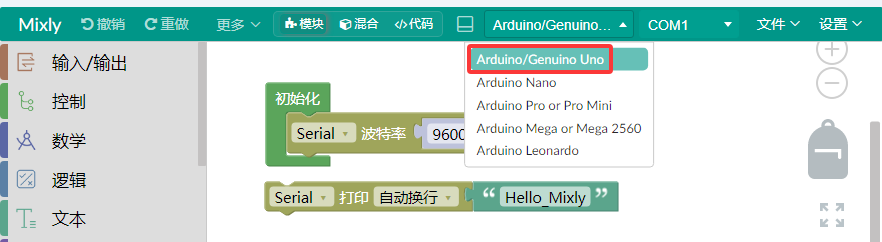

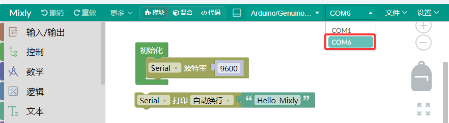

单击  将代码上传到Arduino主控板，如下图所示：

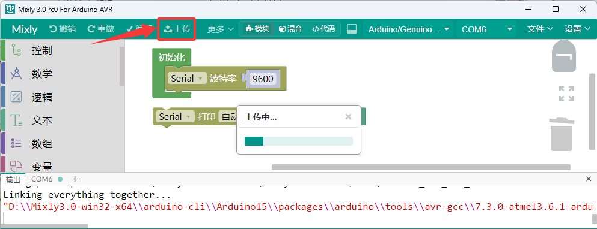

这样，可以看到串口监视器循环打印 “Hello_Mixly”。

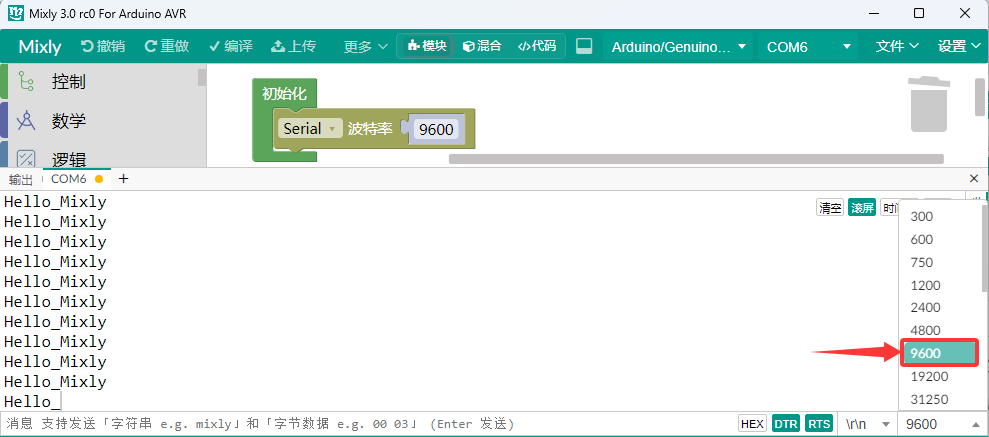

---------------

## 5.7 与Arduino开发板配合使用（以主控板Arduino Uno 板型为例）

### 5.7.1 读取语音指令

**接线图**

用表格和模拟图展示对应模块与扩展板或开发板的GPIO。

| 智能语音模块 | 扩展板/开发板 |
| :--: | :-----------: |
| GND  |      GND      |
| VCC  |      5V       |
| RXD  |      D4       |
| TXD  |      D5       |

**接线模拟图**

  

**实验代码**

  

**实验结果**

按照接线图正确接好模块，选择好正确的开发板板型（Arduino/Genuino Uno）和 适当的串口端口（COMxx），然后单击  按钮上传示例代码至Arduino控制板。代码上传成功后，在Mixly IDE右下角的串口监视器窗口中单击 ，设置串口波特率为 9600。

对着智能语音模块上的麦克风，使用唤醒词 “你好，小智” 或 “小智小智” 来唤醒智能语音模块，同时喇叭播放回复语 “有什么可以帮到您”；接下来即可通过串口打印窗口查看智能语音模块接收到语音命令词所对应的命令码 等。

语音模块唤醒后，对着麦克风说：“打开台灯” 或 “请开灯” 或 “开灯” 或 “打开灯” 或 “我回来了”等命令词时，串口打印命令参数 “1”，同时喇叭播放对应的回复语 “已为您打开照明”。

对着麦克风说：“关闭台灯” 或 “请关灯” 或 “关灯” 或 “睡觉了” 或 “关上灯” 或 “我出去了”等命令词时，串口打印命令参数 “2”，同时喇叭播放对应的回复语 “已为您关闭照明”。

对着麦克风说：“调亮一点” 或 “亮一点”等命令词时，串口打印命令参数 “3”，同时喇叭播放对应的回复语 “灯光已调亮”。

对着麦克风说 “调暗一点” 或 “暗一点”等命令词时，串口打印命令参数 “4”，同时喇叭播放对应的回复语 “灯光已调暗”。

其他的这里就不一一分别陈述，请查看 **产品介绍** 所列的语音识别指令和语音播报指令，所对应的命令码和信息号。

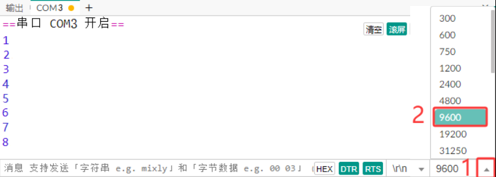

### 5.7.2 语音指令控制SK6812 RGB

⚠️ **特别提醒：这里是以SK6812 RGB模块为例，你也可以使用其他模块。**

⚠️ **特别提醒：如果你没有SK6812 RGB模块，可以自行购买。**

**接线图**

用表格和模拟图展示对应模块与扩展板或开发板的GPIO。

| 智能语音模块 | 扩展板/开发板 |
| :--: | :-----------: |
| GND  |      GND      |
| VCC  |      5V       |
| RXD  |      D4       |
| TXD  |      D5       |

| SK6812 RGB模块 | 扩展板/开发板 |
| :--: | :-----------: |
| G  |      GND      |
| V  |      3.3V      |
| S  |      D11      |

**接线模拟图**

  

**实验代码**

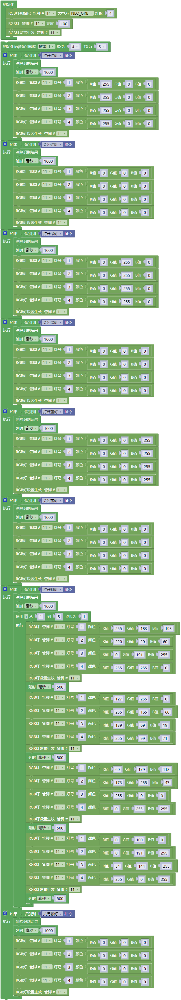  

**实验结果**

按照接线图正确接好模块，选择好正确的开发板板型（Arduino/Genuino Uno）和 适当的串口端口（COMxx），然后单击  按钮上传示例代码至Arduino控制板。代码上传成功后，在Mixly IDE右下角的串口监视器窗口中单击 ，设置串口波特率为 9600。

代码上传成功后，通过智能语音模块来控制SK6812 RGB灯。

对着智能语音模块上的麦克风，使用唤醒词 “你好，小智” 或 “小智小智” 来唤醒智能语音模块，同时喇叭播放回复语 “有什么可以帮到您”；

对着麦克风说：“打开红灯” 等命令词时，喇叭播放对应的回复语 “已为您打开红灯”，同时SK6812 RGB灯亮红色灯；

对着麦克风说：“关闭红灯” 等命令词时，喇叭播放对应的回复语 “已为您关闭红灯”，同时SK6812 RGB灯熄灭；

对着麦克风说：“打开绿灯” 等命令词时，喇叭播放对应的回复语 “已为您打开绿灯”，同时SK6812 RGB灯亮绿色灯；

对着麦克风说：“关闭绿灯” 等命令词时，喇叭播放对应的回复语 “已为您关闭绿灯”，同时SK6812 RGB灯熄灭；

对着麦克风说：“打开蓝灯” 等命令词时，喇叭播放对应的回复语 “已为您打开蓝灯”，同时SK6812 RGB灯亮蓝色灯；

对着麦克风说：“关闭蓝灯” 等命令词时，喇叭播放对应的回复语 “已为您关闭蓝灯”，同时SK6812 RGB灯熄灭；

对着麦克风说：“打开彩灯” 等命令词时，喇叭播放对应的回复语 “已为您打开彩灯”，同时SK6812 RGB灯亮彩色灯；

对着麦克风说：“关闭彩灯” 等命令词时，喇叭播放对应的回复语 “已为您关闭彩灯”，同时SK6812 RGB灯熄灭。

