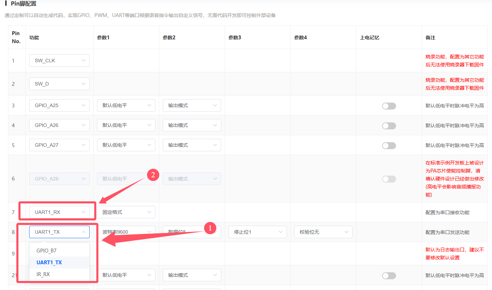
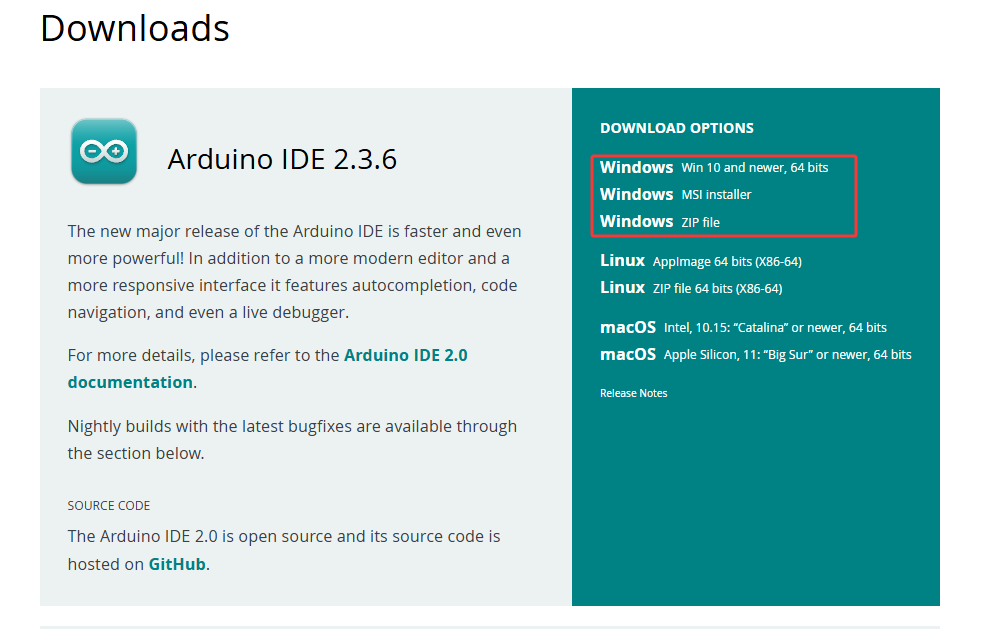
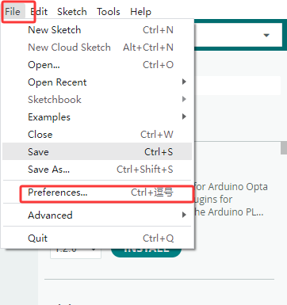

# KE4084 Keyes STEM电子积木 小智中文语音模块 


[TOC]


## 资料下载

[烧录工具及中文固件.7Z (6053.51KiB)](./烧录工具及中文固件.7Z){.open}

## 描述

 小智语音模块，使用MUS516P6为主控芯片，是一款低成本、低功耗、小体积的离线语音识别模组，能快速应用于智能家居，各类智能小家电，86 盒，玩具，灯具等需要语音操控的产品。


## 规格参数

- 工作电压：3.3V~5.5V
- 负载：LDO输出3.3V，外部负载不能超过150MA
- 供电及待机：500MA/60MA
- 硬件: 10个IO口/ 1路uart/ 5个ADC/ 2个PWM/ 1路I2S/ 1路SPI / 1路I2C
- 音频输出： 1路MONO功放输出接口
- FLASH: 2M
- 喇叭功率：8欧1W
- 支持语言：默认固件支持中文（也可自行生成英文）
- 语音指令：70条（最大支持150条）
- 工作温度：0~80℃   
- 尺寸：    47.73*23.93mm
- 重量：8.96g


## 产品特殊接口及功能说明或注意事项

BO和B1为基础固件烧入口

串口RXD和TXD也可以当作I2C使用

B2和B3为PWM口


## 产品原理图

  


## 固件制作说明

**特别提醒：本模块在出厂时，已经导入好了固定的语音固件，如果不想自己制作固件，可以跳过制作固件部分，阅读第六章默认语音固件。**

- 固件烧入

​	首先我们登录网站：[https://smartpi.cn/#/productManage](https://smartpi.cn/#/productManage)，没有账户使用手机号注册一个即可

- 创建产品

​	选择创建产品


​	选择其他产品


​	场景我们选择纯离线方案


​	模组选择SU-03T(US516P6)


选择产品名称和对应的语言，这里我们选择中文，随后点击下一步


- 配置固件

前端信号处理，选择单MIC，远场1-5M


PIN脚配置我们使用GPIO_B6和GPIO_B7，这里把他们改成UART1_RX和UART1_TX



唤醒词和回复设置，也就是你说什么词模块就能听到，并且给你回复，灵敏度我们选择中就可以（唤醒词和回复词都可以随意设置，也可以设置多条，这里我们设置两条）


接下来是最关键的，基本逻辑就是通过命令词给单片机发送指定内容，单片机收到内容后执行指定的操作，例如开关灯，调节亮度之类。

例如我们要设置开灯的话，先设置命令词，随后设置命令词和回复语句


随后我们再点击控制详情


编辑一下控制详情的内容，听到命令词，语言模块使用TX引脚发送一个串数据给单片机


上面只是演示了一条命令，如果需要设置多条的话，就可以如法炮制，添加多条命令


上面是命令词触发的，只能发送命令，那么如果我们要读取数据后再播报出来呢，那么就需要用到串口通信了，我们以读取灯的亮度为例

基本的逻辑就是我们说出读取亮度的命令词，随后模块会给单片机发送一个指令，单片机得到指令后，将亮度的信息回给模块，随后语音模块就把亮度信息读出来

跟之前的一样，我们还是以命令词为先，不过这次要再添加一个接收的串口输入触发了,并为它命名


随后我们点击控制详情，进行添加控制和添加触发


配置完之后，就是两个相配合，这样这个串口读数据的命令也就配置好了

我们配置可以根据需要配置无需唤醒词就可以直接发送的命令词，如果不需要就忽略，注意，唤醒词和免唤醒词一起不能超过10个


再选择合适的人声，音量与亮度之类的


接下里就是一些其他配置，例如开机播报，自动关机，还有关机命令之类的都可以根据自己选择进行设置


配置完后我们就可以申请固件了，鼠标挪到最上面


确认生成成功之后，我们再选择下载固件


打开固件包进行解压


我们打开这个软件，进行烧入 UniOneUpdateTool.exe

找到刚才解压的固件，选择  jx_su_03t_release_update.bin，只要是后缀为release_update.bin就行，文件名可以忽略（注意，固件路径不要出现中文，需要拖拽在桌面后选择固件）


插上Type-C线，观察指示灯不亮，如果亮了请拨动开关，随后重新拔插一下Type-C接口，点击烧录


等待对应的串口出现黄色底条的时候，我们再拨动一次开关，就可以开始烧录了


烧录完成后我们就可以和主控版进行连接并且发出指令了

## 默认语音固件

当然我们也提供过了默认固件，具体内容如下：

**语音识别指令：**

| 命令参数 | 命令词 | 命令回复语 |
| :--: | :--: | :--: |
| 1  | "打开台灯" 或 "请开灯" 或 "开灯" 或 "打开灯" 或 "我回来了" |已为您打开照明|
| 2  |"关闭台灯" 或 "请关灯" 或 "关灯" 或 "睡觉了" 或 "关上灯" 或 "我出去了"|已为您关闭照明|
| 3  |"调亮一点" 或 "亮一点"|灯光已调亮|
| 4  |"调暗一点" 或 "暗一点"|灯光已调暗|
| 5  |"打开风扇" 或 "请开风扇" 或 "开风扇"|已为您打开风扇|
| 6  |"关闭风扇" 或 "请关风扇" 或 "关风扇" 或 "关上风扇"|已为您关闭风扇|
| 7  |"风大一点" 或 "大一点"|风速已增加|
| 8  |"风小一点" 或 "小一点"|风速已减弱|
| 9  |"浇水" 或 "请浇水"|已开始浇水|
| 10 |"停止浇水" 或 "请停止浇水"|已停止浇水|
| 11 |播放音乐|已为您播放音乐|
| 12 |关闭音乐|已为您停止音乐|
| 13 |打开红灯|已为您打开红灯|
| 14 |关闭红灯|已为您关闭红灯|
| 15 |打开绿灯|已为您打开绿灯|
| 16 |关闭绿灯|已为您关闭绿灯|
| 17 |打开蓝灯|已为您打开蓝灯|
| 18 |关闭蓝灯|已为您关闭蓝灯|
| 19 |打开点阵|已为您打开点阵|
| 20 |关闭点阵|已为您关闭点阵|
| 21 |"有人" 或 "有人靠近" 或 "有人过来"|是,有人正过来|
| 22 |"无人" 或 "人远离"|是,没有人|
| 23 |下雨|正在下雨|
| 24 |"停雨" 或 "雨停了"|雨停了|
| 25 |前进|正在前进|
| 26 |后退|正在后退|
| 27 |左转|正在左转|
| 28 |右转|正在右转|
| 29 |循迹|循迹模式开启|
| 30 |跟随|跟随模式开启|
| 31 |避障|避障模式开启|
| 32 |寻光|寻光模式开启|
| 33 |停止|已停止|
| 34 |开始喂食 或 喂食|已开始喂食|
| 35 |停止喂食|已停止喂食|
| 36 |打开彩灯|已为您打开彩灯|
| 37 |关闭彩灯|已为您关闭彩灯|
| 38 |"打开蜂鸣器" 或 "蜂鸣器开始鸣叫"|已打开蜂鸣器|
| 39 |"关闭蜂鸣器" 或 "蜂鸣器停止鸣叫"|已关闭蜂鸣器|
| 40 |增大音量|已增大音量|
| 41 |减小音量|已减小音量|
| 42 |最大音量|已调到最大音量|
| 43 |中等音量|已调到中等音量|
| 44 |最小音量|已调到最小音量|
| 45 |舵机角度增大|舵机角度已增大|
| 46 |舵机角度减少|舵机角度已减少|
| 47 |"当前温度是多少" 或 "当前温度多少"|正在为您读取温度|
| 48 |"当前湿度是多少" 或 "当前湿度多少"|正在为您读取湿度|
| 49 |"当前雨水量是多少" 或 "当前雨量多少"|正在为您读取当前雨水量|
| 50 |"当前光照强度是多少" 或 "光照强度多少" |正在为您读取光照强度|
| 51 |"当前土壤湿度是多少" 或 "土壤湿度多少"|正在为您读取土壤湿度|
| 52 |"当前水位是多少" 或 "水位多少"|正在为您读入水位|
| 53 |"几点了" 或 "现在几点了"|正在为您读取时间|
| 54 |现在距离是多少|正在为您读取距离|
| 55 |开机|已开机 |
| 56 |关机|已关机|

**语音播报指令：**

| 消息号 | 播报指令 |
| :--: | :--: |
| 1  |当前温度为|
| 2  |度|
| 3  |当前雨水量为百分之|
| 4  |当前湿度为百分之|
| 5  |当前光照强度为|
| 6  |当前土壤湿度为百分之|
| 7  |当前水位为|
| 8  |现在是北京时间|
| 9  |当前距离为|
| 10 |点|
| 11 |分|
| 12 |秒|
| 13 |点整|
| 14 |毫升|

## 接线图

  这次我们以主控板arduino uno R4板为例

用表格和模拟图展示对应模块与扩展板或开发板的GPIO。

| 模块 | 扩展板/开发板 |
| :--: | :-----------: |
| GND  |      GND      |
| VCC  |      5V       |
|  RX  |      D4       |
|  TX  |      D5       |

**接线模拟图**


## 环境搭建及示例代码

**安装Arduino IDE（Windows）**

我们先到Arduino官方的网站：[https://www.arduino.cc/en/software/#ide](https://www.arduino.cc/en/software/#ide)

下载最新版本的arduino开发软件，进入网站之后，如下图：

Arduino 软件有很多版本，有wodows,mac ,linux系统的（如下图），而且还有过去老的版本，你只需要下载一个适合系统的版本即可。



这里我们以Windows系统的为例给大家介绍下载和安装的步骤。Windows系统的也有两个版本，一个版本是安装版的，一个是下载版的不用安装，直接下载文件到电脑，解压缩就可以用了。


一般情况下，我们点击JUST DOWNLOAD就可以下载了。

**环境搭建**

首先打开Arduino IDE，首先打开Arduino IDE，File-->Preferences-->Setings-->Lauguage;修改为简体中文接下来点击“OK”，就会自动切换为中文。




安装对应的开发板平台


单击选择开发板选择对应的端口号，选择对应的开发板平台


将下列代码复制到编辑框中，上传到开发板即可

```C
#include <SoftwareSerial.h>

// 定义软件串口引脚（RX, TX）
SoftwareSerial mySerial(4, 5); // 引脚 4 为 RX，引脚 5 为 TX
int pin = 8; //LED的管脚
 


void setup() {
  Serial.begin(9600); // 硬件串口（与电脑通信）
  mySerial.begin(9600); // 软件串口（与外设通信）
  mySerial.println("Software Serial Test");
  pinMode(pin, OUTPUT); //设置管脚为输出模式
  
}

void loop() {
  if(mySerial.available()) { // 接收外设数据
    int c = mySerial.read();//将接收到的外设数据进行赋值
    Serial.print("From device: ");//将接受到的外设数据进行打印
    Serial.println(c);//将接收到的外设数据进行打印
    if(c==1)//进行判断，如果接收到的数据为1
    {
        digitalWrite(pin, HIGH);//打开灯
    }
    if(c==2)//进行判断，如果接收到的数据为2
    {
      digitalWrite(pin, LOW);//关闭灯
    }
  
  }
}
  

```

4、程序烧录进入开发板后，使用唤醒词对模块进行唤醒，随后对模块说“开灯”橙色LED灯便会亮起，对模块说“关灯”橙色LED便会熄灭。


## 常见问题解决方法

1、固件烧录不成功

答：尝试重新拔插接口，点击烧录前确保指示灯不亮，同时检查是否出现对应的COM口

2、模块没有声音

答：重新进行固件烧入，检查电源接线是否正常

3、命令词不回复

答：看固件烧录命令词是否一致，调整固件灵敏度，重新进行烧录

4、无法与主控板通信

答：检查对应引脚是否接线正确，连接是否正常，同时检查固件是否配对正确
